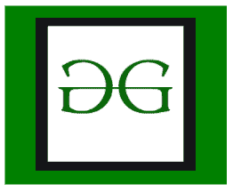
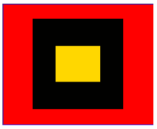
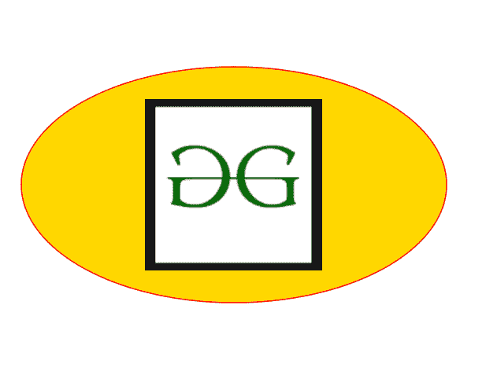

# SVG `<feImage>`元素

> 原文:[https://www.geeksforgeeks.org/svg-feimage-element/](https://www.geeksforgeeks.org/svg-feimage-element/)

SVG 代表可缩放矢量图形。它可以用来制作像在 HTML 画布中的图形和动画。 <feimage>SVG 滤波器原语从外部源获取图像数据，并提供像素数据作为输出。</feimage>

**语法:**

```html
<feImage x="" y="" width="" height="" externalResourcesRequired ="" 
preserveAspectRatio="" xlink:href=""/>

```

**属性:**

*   **x:** 定义用户坐标系中的 x 轴坐标。
*   **y:** 定义用户坐标系中的 y 轴坐标。
*   **宽度:**foreignObject 的宽度。
*   **高度:**foreignObject 的高度。
*   **外部资源需求:**表示当前单据是否需要外部资源。默认值为假。
*   **保留纵横比:**它指示具有提供给定纵横比的视图框的元素必须如何适应具有不同纵横比的视口。
*   **xlink:href:** 它将对资源的引用定义为对 IRI 的引用。
*   **crossorigin:** 告知浏览器对具有跨原点权限的图像文件的请求。

**例 1:**

## 超文本标记语言

```html
<!DOCTYPE html>
<html>

<body>
    <svg width="250" height="250">
        <defs>
            <filter id="id_1">
                <feImage xlink:href=
"https://media.geeksforgeeks.org/wp-content/
uploads/20201106171852/Untitled189-2.png" />
            </filter>
        </defs>

        <g>
            <rect x="1" y="1" width="300" 
                height="200" fill="green" 
                stroke="green" />

            <rect x="50" y="25" width="150" 
                height="150" 
                filter="url(#id_1)" />
        </g>
    </svg>
</body>

</html>
```

**输出:**



**例 2:**

## 超文本标记语言

```html
<!DOCTYPE html>
<html>

<body>
    <svg width="250" height="250">
        <rect id="Img" width="100%" height="80%" 
            stroke="black" fill="gold" />

        <filter id="id_2" 
            primitiveUnits="objectBoundingBox">

            <feImage xlink:href="#Img" x="25%" 
                y="30%" width="50%" height="50%" 
                result="waves" />

            <feComposite operator="atop" 
                in="waves" in2="SourceAlpha" />
        </filter>

        <g>
            <rect x="1" y="1" width="300" 
                height="200" fill="red" 
                stroke="blue" />

            <rect x="50" y="25" width="150" 
                height="150" 
                filter="url(#id_2)" />
        </g>
    </svg>
</body>

</html>
```

**输出:**



**例 3:**

## 超文本标记语言

```html
<!DOCTYPE html>
<html>

<body>
    <svg width="500" height="500">

        <filter id="id_3" 
            primitiveUnits="objectBoundingBox">

            <feImage xlink:href=
"https://media.geeksforgeeks.org/wp-content/
uploads/20201106171852/Untitled189-2.png" 
                x="0" y="0" width="100%" 
                height="100%" 
                preserveAspectRatio="xAlignYAlign"
                result="waves" />

            <feComposite operator="atop" 
                in="waves" in2="SourceImage" />
        </filter>

        <g>
            <ellipse cx="200" cy="150" 
                rx="180" ry="100" fill="gold" 
                stroke="#ff0000" />

            <ellipse cx="200" cy="150" rx="75"
                ry="75" fill="black" 
                filter="url(#id_3)" />
        </g>
    </svg>
</body>

</html>
```

**输出:**

