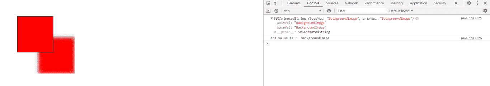
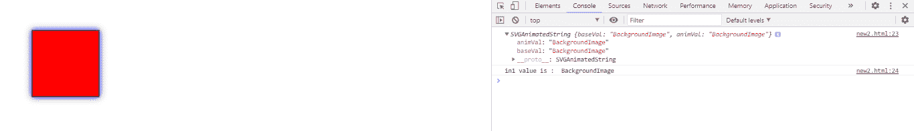

# SVG 女性融合节点 1 属性

> 原文:[https://www.geeksforgeeks.org/svg-femergenode-in1-property/](https://www.geeksforgeeks.org/svg-femergenode-in1-property/)

**SVG FEMergeNode.in1 属性**返回对应于 FEMergeNode 元素的 *in1* 组件的 SVGAnimatedString 对象。

**语法:**

```html
let in_prop = FEMergeNode.in1
```

**返回值:**该属性返回对应于 FEMergeNode 元素的 in1 组件的 SVGAnimatedString 对象。

**例 1:**

## 超文本标记语言

```html
<!DOCTYPE html>
<html>

<body>
    <svg width="200" height="200">
        <filter id="feOffset" x="-40" y="-20" 
            width="100" height="200">

            <feOffset in="SourceGraphic" 
                dx="60" dy="60" />

            <feGaussianBlur stdDeviation="5" 
                result="blur2" />

            <feMerge>
                <feMergeNode in="BackgroundImage" 
                    id="gfg" />
            </feMerge>
        </filter>

        <rect x="40" y="40" width="100" height="100"
            style="stroke: #000000; fill: red; 
                 filter: url(#feOffset);" />

        <rect x="40" y="40" width="100" height="100"
            style="stroke: #000000; fill: red;" />

        <script type="text/javascript">
            let mergeNode = document.getElementById("gfg");
            console.log(mergeNode.in1);

            console.log("in1 value is : ",
                mergeNode.in1.baseVal);
        </script>
    </svg>
</body>

</html>
```

**输出:**



**例 2:**

## 超文本标记语言

```html
<!DOCTYPE html>
<html>

<body>
    <svg width="200" height="200">
        <filter id="feOffset" x="-40" y="-20"
            width="100" height="200">

            <feOffset in="FillPaint" dx="60" 
                dy="60" />

            <feGaussianBlur in="SourceGraphic" 
                stdDeviation="5" />

            <feMerge>
                <feMergeNode in="BackgroundImage" 
                    id="gfg" />
            </feMerge>
        </filter>

        <rect x="40" y="40" width="100" height="100"
            style="stroke: #000000; fill: blue; 
                 filter: url(#feOffset);" />

        <rect x="40" y="40" width="100" height="100" 
            style="stroke: #000000; fill: red;" />

        <script type="text/javascript">
            let mergeNode =
                document.getElementById("gfg");
            console.log(mergeNode.in1);

            console.log("in1 value is : ",
                mergeNode.in1.baseVal)
        </script>
    </svg>
</body>

</html>
```

**输出:**



**支持的浏览器:**

*   谷歌 Chrome
*   边缘
*   火狐浏览器
*   旅行队
*   歌剧
*   微软公司出品的 web 浏览器