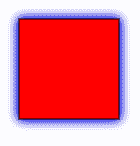
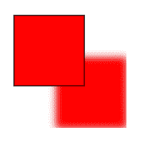

# SVG `<feMergeNode>`标签

> 哎哎哎:# t0]https://www . geeksforgeeks . org/SVG-femergnode 标签/

**<融合节点>** SVG 元素采用另一个过滤器的结果，该过滤器将由其父元素即融合元素处理。

**语法:**

```html
<feMergeNode in="" />
```

**属性:**

*   **in:**in 属性标识给定过滤器原语的输入。

**例 1:**

```html
<!DOCTYPE html>
<html>
<title>SVG Filter</title>

<body>
    <svg width="200" height="200">
        <filter id="feOffset" x="-40" y="-20" 
                width="100" height="200">
            <feOffset in="FillPaint" dx="60" dy="60" />
            <feGaussianBlur in="SourceGraphic" 
                    stdDeviation="5" />
            <feMerge>
                <feMergeNode in="BackgroundImage" />
                <feMergeNode in=
                    "<filter-primitive-reference>" />
            </feMerge>
        </filter>
        <rect x="40" y="40" width="100" height="100" 
            style="stroke: #000000; fill: blue; 
                        filter: url(#feOffset);" />
        <rect x="40" y="40" width="100" height="100" 
            style="stroke: #000000; fill: red;" />
    </svg>
</body>

</html>
```

**输出:**



**例 2:**

```html
<!DOCTYPE html>
<html>
<title>SVG Filter</title>

<body>
    <svg width="200" height="200">

        <filter id="feOffset" x="-40" y="-20" 
                width="100" height="200">
            <feOffset in="SourceGraphic" dx="60" dy="60" />
            <feGaussianBlur stdDeviation="5" result="blur2" />

            <feMerge>
                <feMergeNode in="BackgroundImage" />
                <feMergeNode in="SourceGraphic" />
            </feMerge>
        </filter>

        <rect x="40" y="40" width="100" height="100" 
            style="stroke: #000000; fill: red; 
                filter: url(#feOffset);" />
        <rect x="40" y="40" width="100" height="100" 
            style="stroke: #000000; fill: red;" />
    </svg>
</body>

</html> 
```

**输出:**

