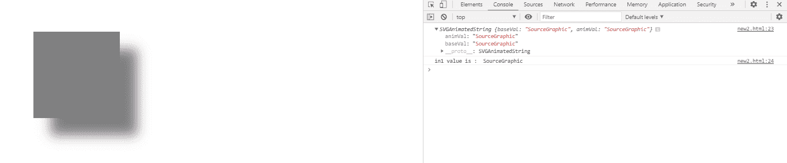
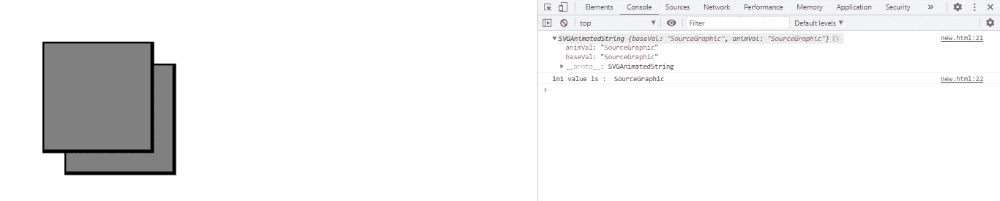

# SVG FEOffset.in1 属性

> 原文:[https://www.geeksforgeeks.org/svg-feoffset-in1-property/](https://www.geeksforgeeks.org/svg-feoffset-in1-property/)

**SVG FEOffset.in1 属性**返回对应于 FEOffset.in1 元素的 in1 组件的 SVGAnimatedString 对象。

**语法:**

```html
var a = FEOffset.in1
```

**返回值:**此属性返回对应于 FEOffset.in1 元素的 in1 组件的 SVGAnimatedString 对象。

**例 1:**

## 超文本标记语言

```html
<!DOCTYPE html>
<html>

<body>
    <svg width="400" height="400">
        <defs>
            <filter id="filter2" x="0" y="0" 
                width="150%" height="150%">

                <feOffset result="offOut" dx="30" 
                    dy="30" in="SourceGraphic" id="gfg" />

                <feGaussianBlur in1="blurOut" 
                    in="offOut" stdDeviation="10" />

                <feBlend in="SourceGraphic" 
                    in2="blurOut" mode="normal" />
            </filter>
        </defs>

        <g>
            <rect x="50" y="50" width="150" 
                height="150" fill="gray" 
                filter="url(#filter2)" />
        </g>

        <script type="text/javascript">
            var g = document.getElementById("gfg");
            console.log(g.in1)
            console.log("in1 value is : ", g.in1.baseVal)
        </script>
    </svg>
</body>

</html>
```

**输出:**



**例 2:**

## 超文本标记语言

```html
<!DOCTYPE html>
<html>

<body>
    <svg width="400" height="400">
        <defs>
            <filter id="filter2" x="0" y="0"
                width="150%" height="150%">

                <feOffset result="offOut" dx="30" 
                    dy="30" in="SourceGraphic" id="gfg" />

                <feBlend in="SourceGraphic" 
                    in2="blurOut" mode="normal" />
            </filter>
        </defs>

        <g>
            <rect x="50" y="50" width="150" 
                height="150" stroke="black" 
                stroke-width="5" fill="gray"
                filter="url(#filter2)" />
        </g>

        <script type="text/javascript">
            var g = document.getElementById("gfg");
            console.log(g.in1);
            console.log("in1 value is : ", g.in1.baseVal)
        </script>
    </svg>
</body>

</html>
```

**输出:**



**支持的浏览器:**

*   谷歌 Chrome
*   边缘
*   火狐浏览器
*   旅行队
*   歌剧
*   微软公司出品的 web 浏览器