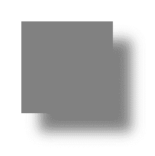
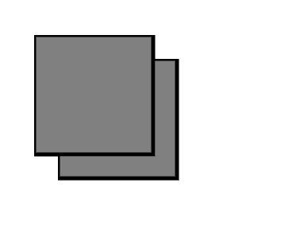

# 【SVG】`<feOffset>`

> [https://www.geeksforgeeks.org/svg-feoffset/](https://www.geeksforgeeks.org/svg-feoffset/)

SVG feOffset 元素用于创建投影效果。要创建投影，取一个 SVG 图形(图像或元素)并移动 XY 坐标。

**语法:**

```html
<feDropShadow dx="" dy="" stdDeviation=""/>
```

**属性:**

*   **dx:** 定义 x 偏移
*   **dy:** 定义 y 偏移
*   **标准差:**定义模糊操作的标准差。

**示例:**

```html
<html>
   <title>SVG Filter</title>
   <body>

      <svg width="400" height="400">

         <defs>
            <filter id="filter2" x="0" y="0"
                    width="150%" height="150%">
               <feOffset result="offOut" dx="30" dy="30" />
               <feGaussianBlur result="blurOut" in="offOut" 
                               stdDeviation="10" />
               <feBlend in="SourceGraphic" in2="blurOut" mode="normal" />
            </filter>
         </defs>

         <g>
            <rect x="50" y="50" width="150" height="150"
            fill="gray" filter="url(#filter2)" />
         </g>

      </svg>

   </body>
</html>
```

**输出:**



**例:**阴影无模糊。

```html
<html>
<title>SVG Filter</title>
<body>

    <svg width="400" height="400">

        <defs>
            <filter id="filter2" x="0" y="0" width="150%" height="150%">
            <feOffset result="offOut" dx="30" dy="30" />
            <feBlend in="SourceGraphic" in2="blurOut" mode="normal" />
            </filter>
        </defs>

        <g>
            <rect x="50" y="50" width="150" height="150"
            stroke="black" stroke-width="5"
            fill="gray" filter="url(#filter2)" />
        </g>

    </svg>

</body>
</html>
```

**输出:**
