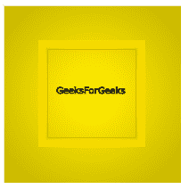
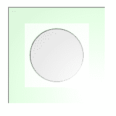
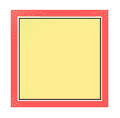

# SVG `<feSpecularLighting>`元素

> 原文:[https://www . geeksforgeeks . org/SVG-fespelarlighting-element/](https://www.geeksforgeeks.org/svg-fespecularlighting-element/)

**<fespeaklarlighting>**SVG 滤镜图元使用 alpha 通道作为凹凸贴图来照亮源图形。

**语法:**

```html
<feSpecularLighting in ="" surfaceScale =""  specularConstant="" 
specularExponent="" kernelUnitLength="" >

```

**属性:**

*   中的**标识给定过滤器原语的输入。**
*   **surfaceScale:** 表示一个光滤镜图元的表面高度。
*   **镜面状态:**控制镜面光的反射比。
*   **镜象组件:**它控制光源的焦点。
*   **kernelUnitLength:** 根据其使用的上下文，它有两种含义。对于光照滤镜图元，它指示 x 和 y 坐标的预期距离，对于<feconvolumematrix>，它指示内核矩阵中连续的列和行之间的预期距离。

**例 1:**

## 超文本标记语言

```html
<!DOCTYPE html>
<html>

<body>
    <svg height="200" width="200">
        <filter id="filter">

            <feSpecularLighting specularExponent="5"
                lighting-color="gold" result="light">

                <fePointLight x="100" y="100" z="100" />
            </feSpecularLighting>

            <feComposite in="SourceGraphic" 
                in2="specOut" operator="arithmetic" 
                k1="1" k2="0" k3="1" k4="0" />
        </filter>

        <rect x="1" y="1" width="200" height="200" 
            style="stroke: #000000; fill: green; 
            filter: url(#filter);" />

        <rect x="50" y="50" width="100" height="100" 
            style="stroke: #000000; fill: green; 
            filter: url(#filter);" />

        <g fill="#FFFFFF" stroke="black" font-size="10" 
            font-family="Verdana">

            <text x="60" y="100">GeeksForGeeks</text>
    </svg>
</body>

</html>
```

**输出:**



**例 2:**

## 超文本标记语言

```html
<!DOCTYPE html>
<html>

<body>
    <svg height="200" width="200" 
        viewBox="0 0 220 220">

        <filter id="filter">

            <feSpecularLighting specularExponent="2"
                lighting-color="shadow" result="light">

                <fePointLight x="200" y="200" z="100" />
            </feSpecularLighting>

            <feComposite in="SourceGraphic" 
                in2="specOut" operator="arithmetic" 
                k1="0" k2="1" k3="1" k4="0" />
        </filter>

        <rect x="40" y="40" width="200" height="200" 
            style="stroke: black; fill: green;
            filter: url(#filter);" />

        <circle cx="130" cy="130" r="50" style=
            "fill: black; filter:url(#filter)" />
    </svg>
</body>

</html>
```

**输出:**



**例 3:**

## 超文本标记语言

```html
<!DOCTYPE html>
<html>

<body>
    <svg height="200" width="200" 
        viewBox="0 0 220 220">

        <filter id="filter">

            <feSpecularLighting in="BackgroundImage"
                specularConstant="0.8" surfaceScale="1"
                specularExponent="20" kernelUnitLength="1"
                lighting-color="red">

                <fePointLight x="100" y="100" z="220" />
            </feSpecularLighting>

            <feComposite in="SourceGraphic" in2="specOut"
                operator="arithmetic" k1="0" k2="1" 
                k3="1" k4="0" />
        </filter>

        <rect x="40" y="40" width="100" height="100" 
            style="stroke: #000000; fill: lightgreen; 
                filter: url(#filter);" />
    </svg>
</body>

</html>
```

**输出:**

