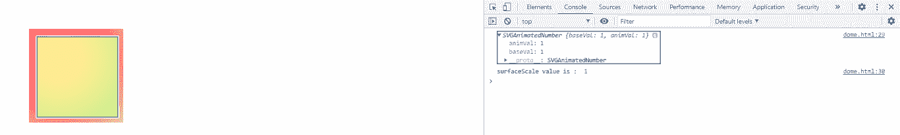
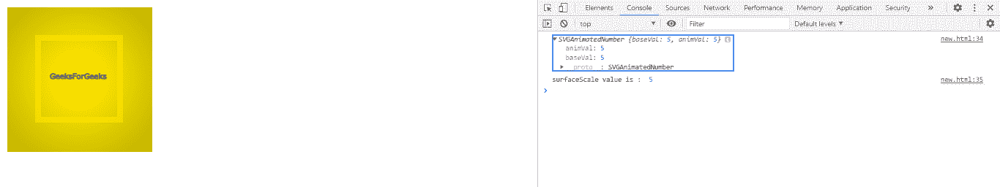
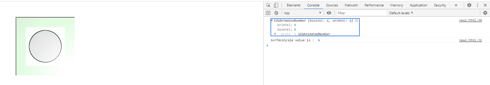

# SVG fespelarlighting . surface scale 属性

> 原文:[https://www . geeksforgeeks . org/SVG-fespelarlighting-surface scale-property/](https://www.geeksforgeeks.org/svg-fespecularlighting-surfacescale-property/)

**SVG FeSpecularllighting . surfaceScale 属性**返回对应于 FeSpecularllighting . surface scale 元素的 surface scale 组件的 SVGAnimatedNumber 对象。

**语法:**

```html
var a = FESpecularLighting.surfaceScale
```

**返回值:**该属性返回对应于 fesspecularllighting . surfaceScale 元素的 surface scale 组件的 SVGAnimatedNumber 对象。

**例 1:**

## 超文本标记语言

```html
<!DOCTYPE html>
<html>

<body>
    <svg height="200" width="200" 
        viewBox="0 0 220 220">

        <filter id="filter">

            <feSpecularLighting in="BackgroundImage"
                specularConstant="0.8" surfaceScale="1" 
                specularExponent="20" kernelUnitLength="1" 
                lighting-color="red" id="gfg">

                <fePointLight x="100" y="100" z="220" />
            </feSpecularLighting>

            <feComposite in="SourceGraphic" in2="specOut" 
                operator="arithmetic" k1="0" k2="1" 
                k3="1" k4="0" />
        </filter>

        <rect x="60" y="60" width="150" height="150" 
            style="stroke: #000000; fill: lightgreen; 
                filter: url(#filter);" />

        <script type="text/javascript">
            var g = document.getElementById("gfg");
            console.log(g.surfaceScale);

            console.log("surfaceScale value is : ", 
                g.surfaceScale.baseVal)
        </script>
    </svg>
</body>

</html>
```

**输出:**



**例 2:**

## 超文本标记语言

```html
<!DOCTYPE html>
<html>

<body>
    <svg height="200" width="200">
        <filter id="filter">

            <feSpecularLighting specularExponent="5"
                lighting-color="gold" result="light" 
                surfaceScale="5" in="SourceGraphic" 
                id="gfg">

                <fePointLight x="100" y="100" z="100" />
            </feSpecularLighting>

            <feComposite in="SourceGraphic" 
                in2="specOut" operator="arithmetic" 
                k1="1" k2="0" k3="1" k4="0" />
        </filter>

        <rect x="1" y="1" width="200" height="200" 
            style="stroke: #000000; fill: green; 
            filter: url(#filter);" />

        <rect x="50" y="50" width="100" height="100" 
            style="stroke: #000000; fill: green; 
            filter: url(#filter);" />

        <g fill="#FFFFFF" stroke="black" 
            font-size="10" font-family="Verdana" />

        <text x="60" y="100">GeeksForGeeks</text>

        <script type="text/javascript">
            var g = document.getElementById("gfg");
            console.log(g.surfaceScale);

            console.log("surfaceScale value is : ", 
                g.surfaceScale.baseVal)
        </script>
    </svg>
</body>

</html>
```

**输出:**



**例 3:**

## 超文本标记语言

```html
<!DOCTYPE html>
<html>

<body>
    <svg height="200" width="200" 
        viewBox="0 0 220 220">

        <filter id="filter">
            <feSpecularLighting specularExponent="2"
                lighting-color="shadow" result="light" 
                surfaceScale="6" in="BackgroundImage" 
                id="gfg">

                <fePointLight x="200" y="200" z="100" />
            </feSpecularLighting>

            <feComposite in="SourceGraphic" 
                in2="specOut" operator="arithmetic" 
                k1="0" k2="1" k3="1" k4="0" />
        </filter>

        <rect x="40" y="40" width="200" height="200" 
            style="stroke: black; fill: green; 
            filter: url(#filter);" />

        <circle cx="130" cy="130" r="50" 
            style="fill: black; filter:url(#filter)" />

        <script type="text/javascript">
            var g = document.getElementById("gfg");
            console.log(g.surfaceScale);

            console.log("surfaceScale value is : ", 
                g.surfaceScale.baseVal)
        </script>
    </svg>
</body>

</html>
```

**输出:**



**支持的浏览器:**

*   谷歌 Chrome
*   边缘
*   火狐浏览器
*   旅行队
*   歌剧
*   微软公司出品的 web 浏览器