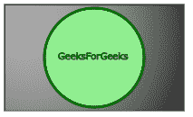

# SVG `<feSpotLight>`元素

> 原文:[https://www.geeksforgeeks.org/svg-fespotlight-element/](https://www.geeksforgeeks.org/svg-fespotlight-element/)

SVG 代表可缩放矢量图形。它可以用来制作像在 HTML 画布中的图形和动画。
**<fespot light>**SVG 定义了一个产生聚光灯效果的光源。它定义了一个聚光灯，其光指向特定的点，并且只照亮有限的区域。

**语法:**

```html
<feSpotLight x="" y="" z="" pointsAtX="" pointsAtY="" 
    pointsAtZ="" specularExponent="" limitingConeAngle="" />

```

**属性:**

*   **x，y，z:** 它告诉坐标系统中对应的 x，y，z。
*   **点 sAtX，点 sAtY，点 sAtZ:** 光线照射的点的 X，Y，Z 位置。
*   **镜象组件:**它告诉光在单个点上的焦点。默认值为 1。
*   **限制锥角:**表示两个直线之间的角度，即点光轴和点光锥。

**例 1:**

```html
<!DOCTYPE html>
<html>

<body>
    <svg width="200" height="200">
        <defs>
            <filter id="spotlight">
                <feSpecularLighting result="spec3" 
                    in="blur3" specularConstant="1.2" 
                    specularExponent="7"
                    lighting-color="#FFF">

                    <feSpotLight x="400" y="400" 
                        z="900" limitingConeAngle="9" />
                </feSpecularLighting>

                <feComposite in="SourceGraphic" 
                    in2="spotlight" operator="out" 
                    k1="0" k2="1" k3="1" k4="0" />
            </filter>
        </defs>

        <rect x="40" y="40" width="100" height="100" 
            style="stroke: #000000;
                fill: lightgreen;
                filter: url(#spotlight);" />

        <rect x="40" y="40" width="100" height="100" 
            style="stroke: #000000; 
                fill: green; 
                filter: url(#spotlight);" />

        <g fill="#FFFFFF" stroke="black" font-size="10" 
            font-family="Verdana">

            <text x="50" y="90">GeeksForGeeks</text>
    </svg>
</body>

</html>
```

**输出:**


**例 2:**

```html
<!DOCTYPE html>
<html>

<body>
    <svg width="200" height="200">
        <defs>
            <filter id="FillPaint">
                <feSpecularLighting result="spec3" 
                    in="blur3" specularConstant="1.2" 
                    specularExponent="7"
                    lighting-color="#FFF">

                    <feSpotLight x="600" y="600" 
                        z="1200" pointAtX="400" 
                        pointAtY="400" pointAtZ="400"
                        limitingConeAngle="9" />
                </feSpecularLighting>

                <feComposite in="SourceGraphic" 
                    in2="spotlight" operator="out" 
                    k1="0" k2="1" k3="1" k4="0" />
            </filter>
        </defs>

        <rect x="1" y="1" width="198" 
            height="118" style="stroke: #000000; 
                                fill: black;
                        filter: url(#FillPaint);" />

        <circle cx="100" cy="60" r="55" 
            stroke="darkgreen" stroke-width="3" 
            fill="Lightgreen"
            style="stroke: filter: url(#FillPaint);" />

        <g fill="#FFFFFF" stroke="Green" 
            font-size="10" c font-family="Verdana">
            <text x="60" y="62">GeeksForGeeks</text>
    </svg>
</body>

</html>
```

**输出:**

