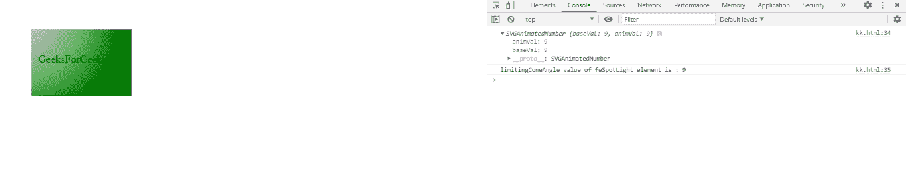
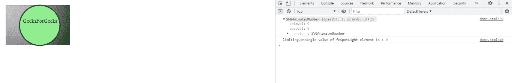

# SVG fespot lightelement . limingconangle 属性

> 原文:[https://www . geeksforgeeks . org/SVG-fespot lightelement-limiting cone angle-property/](https://www.geeksforgeeks.org/svg-fespotlightelement-limitingconeangle-property/)

**SVG fespotlowelement . limitingConeAngle 属性**返回与 fespotlowelement . LimitingConangle 元素的 LimitingConangle 属性对应的 SVGAnimatedNumber 对象。

**语法:**

```html
var a = FESpotLightElement.limitingConeAngle
```

**返回值:**该属性返回对应于 fespot lightelement . limitingConeAngle 元素的 limiting conangle 属性的 SVGAnimatedNumber 对象。

**例 1:**

```html
<!DOCTYPE html>
<html>

<body>
    <svg width="200" height="200">
        <defs>
            <filter id="spotlight">
                <feSpecularLighting result="spec3" 
                    in="blur3" specularConstant="1.2" 
                    lighting-color="#FFF">

                    <feSpotLight x="400" y="400" z="900"
                        limitingConeAngle="9" 
                        specularExponent="10" id="gfg" />
                </feSpecularLighting>

                <feComposite in="SourceGraphic" 
                    in2="spotlight" operator="out" 
                    k1="0" k2="1" k3="1" k4="0" />
            </filter>
        </defs>

        <rect x="40" y="40" width="150" 
            height="100" style="stroke: #000000; 
                fill: green; 
                filter: url(#spotlight);"/>

        <g fill="#FFFFFF" stroke="black" 
            font-size="10" font-family="Verdana" />

        <text x="50" y="90">GeeksForGeeks</text>

        <script type="text/javascript">
            var g = document.getElementById("gfg");
            console.log(g.limitingConeAngle);

            console.log("limitingConeAngle value "
                + "of feSpotLight element is :" 
                + g.limitingConeAngle.baseVal)
        </script>
    </svg>
</body>

</html>
```

**输出:**



**例 2:**

```html
<!DOCTYPE html>
<html>

<body>
    <svg width="200" height="200">
        <defs>
            <filter id="FillPaint">
                <feSpecularLighting result="spec3" 
                    in="blur3" specularConstant="1.2" 
                    lighting-color="#FFF">

                    <feSpotLight x="600" y="600" 
                        z="1200" pointAtX="400" 
                        pointAtY="400" pointAtZ="400"
                        specularExponent="7" 
                        limitingConeAngle="9" id="gfg" />
                </feSpecularLighting>

                <feComposite in="SourceGraphic" 
                    in2="spotlight" operator="out" 
                    k1="0" k2="1" k3="1" k4="0" />
            </filter>
        </defs>

        <rect x="10" y="10" width="198" 
            height="118" style="stroke: #000000; 
                        fill: black; 
                  filter: url(#FillPaint);" />

        <circle cx="110" cy="70" r="60" 
            stroke="darkgreen" stroke-width="3" 
            fill="Lightgreen"
            style="stroke: filter: url(#FillPaint);" />

        <g fill="#FFFFFF" stroke="Green" 
            font-size="10" font-family="Verdana" />

        <text x="60" y="62">GeeksForGeeks</text>

        <script type="text/javascript">
            var g = document.getElementById("gfg");
            console.log(g.limitingConeAngle);
            console.log("limitingConeAngle value "
                + "of feSpotLight element is : "
                + g.limitingConeAngle.baseVal)
        </script>
    </svg>
</body>

</html>
```

**输出:**



**支持的浏览器:**

*   谷歌 Chrome
*   边缘
*   火狐浏览器
*   旅行队
*   歌剧
*   微软公司出品的 web 浏览器