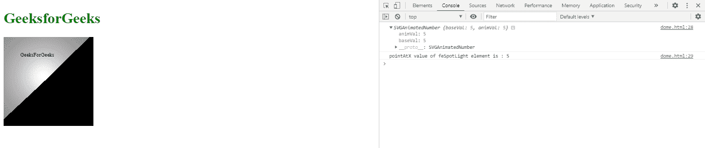

# SVG 聚光灯元素. pointsAtX 性质

> 原文:[https://www . geeksforgeeks . org/SVG-fespot lightelement-point satx-property/](https://www.geeksforgeeks.org/svg-fespotlightelement-pointsatx-property/)

**SVG FESpotLightElement.pointsAtX 属性**返回与 fespot lightelement . pointsAtX 元素的 point satx 属性对应的 SVGAnimatedNumber 对象。

**语法:**

```html
var a = FESpotLightElement.pointsAtX
```

**返回值:**该属性返回对应于 FESpotLightElement.pointsAtX 元素的 pointsAtX 属性的 SVGAnimatedNumber 对象。

**例 1:**

## 超文本标记语言

```html
<!DOCTYPE html> 
<html> 

<body> 
    <div style="color: green;"> 
        <h1> 
            GeeksforGeeks 
        </h1> 

        <svg viewBox="0 0 1120 350"
            xmlns="http://www.w3.org/2000/svg"> 

            <filter id="Geek" width="100%"
                height="100%"> 
                <feDiffuseLighting in="SourceGraphic"> 
                    <feSpotLight x="120" y="120"
                        z="50" pointsAtZ="5" pointsAtX="5" 
                        pointsAtY="5" id="Geek2"/> 
                </feDiffuseLighting> 
            </filter> 

            <rect width="300" height="300"
                style="filter: url(#Geek);"/>

                <text x="50" y="60">GeeksForGeeks</text>
            <script type="text/javascript">
                var g = document.getElementById("Geek2");
                console.log(g.pointsAtX);
                console.log("pointAtX value of feSpotLight "+
                "element is : "+g.pointsAtX.baseVal)
            </script>
        </svg> 
    </div> 
</body> 

</html>
```

**输出:**



**例 2:**

## 超文本标记语言

```html
<!DOCTYPE html> 
<html> 

<body> 
    <svg width="200" height="200"> 
        <defs> 
            <filter id="spotlight"> 
                <feSpecularLighting result="spec3"
                    in="blur3" specularConstant="1.2"
                    lighting-color="#FFF"> 

                    <feSpotLight x="400" y="400"
                        z="900" pointsAtZ="5" pointsAtX="5" 
                        pointsAtY="5" limitingConeAngle="9"
                        specularExponent="10" id="gfg"/> 
                </feSpecularLighting> 

                <feComposite in="SourceGraphic"
                    in2="spotlight" operator="out"
                    k1="0" k2="1" k3="1" k4="0" /> 
            </filter> 
        </defs> 

        <rect x="40" y="40" width="150" height="100"
            style="stroke: #000000; 
                fill: green; 
                filter: url(#spotlight);" /> 

        <g fill="#FFFFFF" stroke="black" font-size="10"
            font-family="Verdana"/> 

            <text x="50" y="90">GeeksForGeeks</text> 

        <script type="text/javascript">
            var g = document.getElementById("gfg");
            console.log(g.pointsAtX);
            console.log("pointsAtX value of feSpotLight "+
            "element is : "+g.pointsAtX.baseVal)
        </script>
    </svg> 
</body> 

</html>
```

**输出:**


**支持的浏览器:**

*   谷歌 Chrome
*   边缘
*   火狐浏览器
*   旅行队
*   歌剧
*   微软公司出品的 web 浏览器