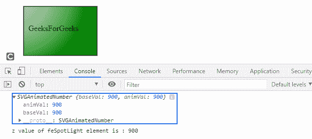
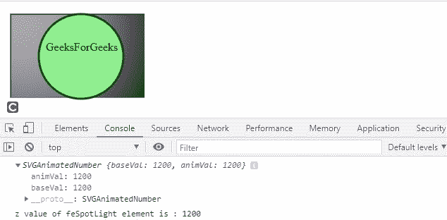

# SVG FESpotLightElement.z 属性

> 原文:[https://www . geeksforgeeks . org/SVG-fespot lightelement-z-property/](https://www.geeksforgeeks.org/svg-fespotlightelement-z-property/)

**SVG***fespot lightelement . z*属性返回与 *FESpotLightElement.z* 元素的 z 属性对应的 SVGAnimatedNumber 对象。

**语法:**

```html
var a = FESpotLightElement.z 
```

**返回值:**该属性返回 FESpotLightElement.z 元素的 z 属性对应的 SVGAnimatedNumber 对象。

**例 1:**

## 超文本标记语言

```html
<!DOCTYPE html>
<html>

<body>
    <svg width="200" height="200">
        <defs>
            <filter id="spotlight">
                <feSpecularLighting result="spec3" 
                    in="blur3" specularConstant="1.2" 
                    specularExponent="7"
                    lighting-color="#FFF">

                    <feSpotLight x="400" y="400" z="900" 
                    limitingConeAngle="9" id="gfg" />
                </feSpecularLighting>

                <feComposite in="SourceGraphic" 
                    in2="spotlight" operator="out" 
                    k1="0" k2="1" k3="1" k4="0" />
            </filter>
        </defs>

        <rect x="40" y="40" width="150" 
            height="100" style="stroke: #000000; 
                fill: green; 
                filter: url(#spotlight);" />

        <g fill="#FFFFFF" stroke="black" 
            font-size="10" font-family="Verdana" />

        <text x="50" y="90">GeeksForGeeks</text>

        <script type="text/javascript">
            var g = document.getElementById("gfg");
            console.log(g.z);
            console.log("z value of feSpotLight "
                + "element is : " + g.z.baseVal)
        </script>
    </svg>
</body>

</html>
```

**输出:**



**例 2:**

## 超文本标记语言

```html
<!DOCTYPE html>
<html>

<body>
    <svg width="200" height="200">
        <defs>
            <filter id="FillPaint">
                <feSpecularLighting result="spec3" 
                    in="blur3" specularConstant="1.2" 
                    specularExponent="7"
                    lighting-color="#FFF">

                    <feSpotLight x="600" y="600" z="1200" 
                        pointAtX="400" pointAtY="400" 
                        pointAtZ="400"
                        limitingConeAngle="9" id="gfg" />
                </feSpecularLighting>

                <feComposite in="SourceGraphic" 
                    in2="spotlight" operator="out" 
                    k1="0" k2="1" k3="1" k4="0" />
            </filter>
        </defs>

        <rect x="10" y="10" width="198" height="118" 
            style="stroke: #000000; fill: black; 
                  filter: url(#FillPaint);" />

        <circle cx="110" cy="70" r="60" 
            stroke="darkgreen" stroke-width="3" 
            fill="Lightgreen"
            style="stroke: filter: url(#FillPaint);" />

        <g fill="#FFFFFF" stroke="Green" 
            font-size="10" c font-family="Verdana" />

        <text x="60" y="62">GeeksForGeeks</text>

        <script type="text/javascript">
            var g = document.getElementById("gfg");
            console.log(g.z);
            console.log("z value of feSpotLight "
                + "element is : " + g.z.animVal)
        </script>
    </svg>
</body>

</html>
```

**输出:**



**支持的浏览器:**

*   谷歌 Chrome
*   边缘
*   火狐浏览器
*   旅行队
*   歌剧
*   微软公司出品的 web 浏览器