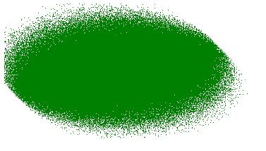
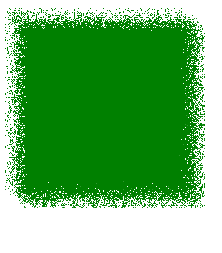

# SVG `<feTurbulence>`元素

> 原文:[https://www.geeksforgeeks.org/svg-feturbulence-element/](https://www.geeksforgeeks.org/svg-feturbulence-element/)

<feturbulence>SVG 滤波器产生的噪声有助于模拟几种自然现象，如云、火和烟，并产生复杂的纹理，如大理石或花岗岩。
噪声可用于扭曲图像和文本。柏林湍流函数用于产生柏林噪声。</feturbulence>

**语法:**

```html
<feTurbulence type = "" baseFrequency = ""
 numOctaves = "" seed = "" slitchTiles = "" />
```

**属性:**

*   **类型:**有两个值，即**湍流/分形噪声。**默认值为**湍流。**
*   **基本频率:**它影响产生的噪声的大小(或尺度)和颗粒。默认值为 **0** 。
*   **numOctaves:** 定义噪声的频率或细节。默认值为 **1。**
*   **seed:** 它为随机函数提供了不同的起始数。
*   **stitchTiles:** 当你有两个相邻的噪点区域时，用来创建拼接效果。它定义了边界和拐角处柏林噪声的行为。

**例 1:**

```html
<!DOCTYPE html>
<html>

<body>

    <svg width="400" height="400" 
        viewBox="0 0 250 250">

        <filter id="FillPaint">

            <feTurbulence type="fractalNoise" 
                baseFrequency="2" numOctaves="2" 
                seed="1" stitchTiles="nostitch"
                result="turbulence" />

            <feDisplacementMap in2="turbulence" 
                in="SourceGraphic" scale="50" 
                xChannelSelector="B"
                yChannelSelector="B" />

        </filter>

        <ellipse cx="100" cy="60" rx="100" 
            ry="50" style=" fill: green; 
            filter: url(#FillPaint);" />
    </svg>
</body>

</html>
```

**输出:**



**例 2:**

```html
<!DOCTYPE html>
<html>

<body>

    <svg width="200" height="200" 
        viewBox="0 0 220 220">

        <filter id="FillPaint">

            <feTurbulence type="Turbulence" 
                baseFrequency="0.5" numOctaves="2" 
                seed="5" stitchTiles="stitch" />

            <feDisplacementMap in2="turbulence" 
                in="SourceGraphic" scale="50" 
                xChannelSelector="B"
                yChannelSelector="B" />

        </filter>

        <rect width="200" height="200" 
            style=" fill:green;
            filter: url(#FillPaint);" />
    </svg>
</body>

</html>
```

**输出:**

