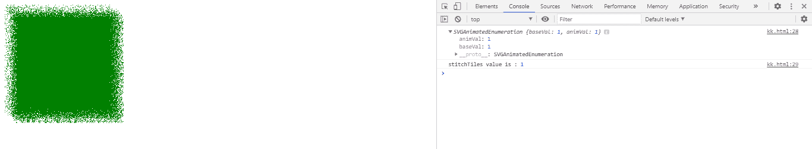
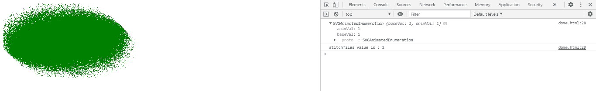

# SVG fetumbulation element . stitchtiles 属性

> 原文:[https://www . geeksforgeeks . org/SVG-fethurbeifelement-stitchtiles-attribute/](https://www.geeksforgeeks.org/svg-feturbulenceelement-stitchtiles-attribute/)

**SVG fetumble element . stitchTiles 属性**返回与 FETurbulencee.stitchTiles 元素的 stitchTiles 组件对应的 SVGAnimatedEnumeration 对象。

**语法:**

```html
var a = FETurbulenceElement.stitchTiles
```

**返回值:**该属性返回与 FETurbulencee.stitchTiles 元素的 stitchTiles 组件对应的 SVGAnimatedEnumeration 对象。

**例 1:**

## 超文本标记语言

```html
<!DOCTYPE html> 
<html> 

<body> 

    <svg width="200" height="200"
        viewBox="0 0 220 220"> 

        <filter id="FillPaint"> 

            <feTurbulence id='gfg' type="turbulence"
                baseFrequency="0.5" numOctaves="2"
                seed="5" stitchTiles="stitch" /> 

            <feDisplacementMap in2="turbulence"
                in="SourceGraphic" scale="50"
                xChannelSelector="B"
                yChannelSelector="B" /> 

        </filter> 

        <rect width="200" height="200"
            style=" fill:green; 
            filter: url(#FillPaint);" />

        <script type="text/javascript">
            var g = document.getElementById("gfg");
            console.log(g.stitchTiles);
            console.log("stitchTiles value is :",
                g.stitchTiles.baseVal);
        </script> 
    </svg> 
</body> 

</html>
```

**输出:**



**例 2:**

## 超文本标记语言

```html
<!DOCTYPE html> 
<html> 

<body> 

    <svg width="400" height="400"
        viewBox="0 0 250 250"> 

        <filter id="FillPaint"> 

            <feTurbulence id="gfg" type="fractalNoise"
                baseFrequency="2" numOctaves="2"
                seed="1" stitchTiles="stitch"
                result="turbulence" /> 

            <feDisplacementMap in2="turbulence"
                in="SourceGraphic" scale="50"
                xChannelSelector="B"
                yChannelSelector="B" /> 

        </filter> 

        <ellipse cx="100" cy="60" rx="100"
            ry="50" style=" fill: green; 
            filter: url(#FillPaint);" /> 
        <script type="text/javascript">
            var g = document.getElementById("gfg");
            console.log(g.stitchTiles);
            console.log("stitchTiles value is :",
                g.stitchTiles.baseVal);
        </script>
    </svg> 
</body> 

</html>
```

**输出:**



**支持的浏览器:**

*   谷歌 Chrome
*   边缘
*   火狐浏览器
*   旅行队
*   歌剧
*   微软公司出品的 web 浏览器