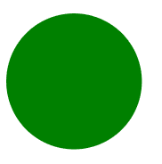

# SVG 填充属性

> 原文:[https://www.geeksforgeeks.org/svg-fill-attribute/](https://www.geeksforgeeks.org/svg-fill-attribute/)

**填充**属性可以用于两种情况。对于形状和文本，它是定义用于绘制元素的颜色的表示属性。对于动画，它定义了动画的最终状态。

**语法:**

```html
fill= "colour"
```

**属性值:**

*   **绘制:**我们要绘制元素的颜色。

我们将使用填充属性来设置元素的颜色。

**示例 1:** 在本例中，我们将使用 fill 属性来设置 rect 元素的颜色。

```html
<!DOCTYPE html>
<html>

<body>
    <svg viewBox="0 0 700 350" 
        xmlns="http://www.w3.org/2000/svg">

        <rect height="70" width="60" 
                fill="green" />
    </svg>
</body>

</html>
```

**输出:**


**示例 2:** 在本例中，我们将使用填充属性来设置圆元素的颜色。

```html
<html>

<body>
    <svg viewBox="0 0 700 350" 
        xmlns="http://www.w3.org/2000/svg">

        <circle cx="50" cy="50" 
            r="40" fill="green" />
    </svg>
</body>

</html>
```

**输出:**

