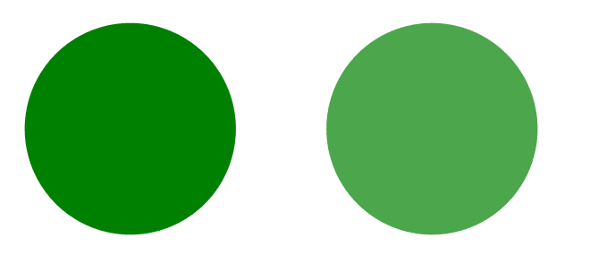
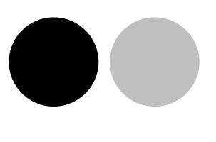

# SVG 填充-不透明度属性

> 原文:[https://www.geeksforgeeks.org/svg-fill-opacity-attribute/](https://www.geeksforgeeks.org/svg-fill-opacity-attribute/)

**填充-不透明度**属性是一个表示属性，用于定义应用于形状的绘制的不透明度。

**语法:**

```html
fill-opacity="colour"
```

**属性值:**

*   **十进制:**我们想要使元素不透明的十进制值。
*   **百分比:**我们要设置填充不透明度属性的百分比。

我们将使用填充不透明度属性来设置填充颜色的不透明度。

**例 1:**

```html
<!DOCTYPE html> 
<html> 

<body> 
    <svg viewBox="0 0 400 100" 
         xmlns="http://www.w3.org/2000/svg">
        <circle cx="50" cy="50" r="35" fill="green"/>

        <circle cx="150" cy="50" r="35" fill="green"
        fill-opacity="0.7" />
    </svg>
</body> 

</html>
```

**输出:**



**例 2:**

```html
<!DOCTYPE html> 
<html> 

<body> 
    <svg viewBox="0 0 400 100"
        xmlns="http://www.w3.org/2000/svg">
        <circle cx="60" cy="60" r="40" fill="black"/>

        <circle cx="150" cy="60" r="40" fill="black"
        fill-opacity="25%" />
    </svg>
</body> 

</html>
```

**输出:**

