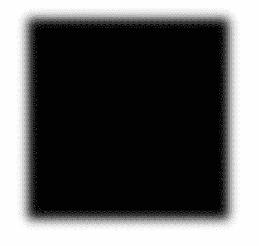
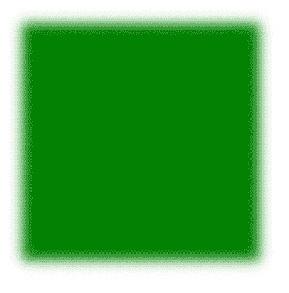

# SVG 过滤器属性

> 原文:[https://www.geeksforgeeks.org/svg-filter-attribute/](https://www.geeksforgeeks.org/svg-filter-attribute/)

**滤镜**属性用于指定由<滤镜>元素定义的滤镜效果，该滤镜效果将应用于其元素。

**语法:**

```html
filter="value"

```

**属性值:**

*   **值:**要应用于元素的过滤器值

我们将使用*过滤器*属性来设置元素的过滤器。

**例 1:**

## 超文本标记语言

```html
<!DOCTYPE html>
<html>

<body>
    <svg viewBox="0 0 800 800" 
        xmlns="http://www.w3.org/2000/svg">

        <filter id="fil">

            <!--Using GaussianBlur filter effect-->
            <feGaussianBlur stdDeviation="5" />
        </filter>

        <rect x="80" y="30" width="200" 
            height="200" filter="url(#fil)" />
    </svg>
</body>

</html>
```

**输出:**



**例 2:**

## 超文本标记语言

```html
<!DOCTYPE html>
<html>

<body>
    <svg viewBox="0 0 800 800" 
        xmlns="http://www.w3.org/2000/svg">

        <filter id="blur">

            <!--> Using GaussianBlur filter effect<--->
            <feGaussianBlur stdDeviation="5" />
        </filter>
        <rect x="80" y="30" width="200" 
            height="200" filter="url(#blur)" 
            fill="green" />
    </svg>
</body>

</html>
```

**输出:**

