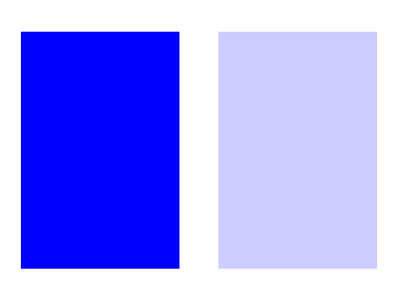

# SVG 泛光不透明度属性

> 原文:[https://www.geeksforgeeks.org/svg-flood-opacity-attribute/](https://www.geeksforgeeks.org/svg-flood-opacity-attribute/)

**泛光-不透明度**属性表示要在当前过滤器图元子区域中使用的不透明度值。

**语法:**

```html
flood-opacity="flood"
```

**属性值:**

*   **泛洪:**一个数字或百分比，指示要在当前滤镜图元子区域中使用的不透明度值

我们将使用填充不透明度属性来设置填充颜色的不透明度。

**例 1:**

```html
<!DOCTYPE html>
<html>

<body>
    <svg viewBox="0 0 1000 500" 
        xmlns="http://www.w3.org/2000/svg">

        <filter id="flood1">
            <feFlood flood-color="green" 
                x="40" y="40" width="200" 
                height="200" />
        </filter>

        <filter id="flood2">
            <feFlood flood-color="green" 
                flood-opacity="0.3" x="300" 
                y="40" width="200" 
                height="200" />
        </filter>

        <rect x="100" y="100" 
            width="1000" height="1000" 
            style="filter: url(#flood1);" />

        <rect x="100" y="100" 
            width="1000" height="1000" 
            style="filter: url(#flood2);" />
    </svg>
</body>

</html>
```

**输出:**


**例 2:**

```html
<!DOCTYPE html>
<html>
    <body>
        <svg viewBox="0 0 700 500"
             xmlns="http://www.w3.org/2000/svg">
            <filter id="flood1">
                <feFlood flood-color="blue" 
                         x="50" y="50"
                         width="200" 
                         height="300" />
            </filter>
            <filter id="flood2">
                <feFlood flood-color="blue"
                         flood-opacity="0.2" 
                         x="300" y="50"
                         width="200" 
                         height="300" />
            </filter>

            <rect x="100" y="100" 
                  width="1000" 
                  height="1000" 
                  style="filter: url(#flood1);" />
            <rect x="100" y="100" 
                  width="1000"
                  height="1000" 
                  style="filter: url(#flood2);" />
        </svg>
    </body>
</html>
```

**输出:**

