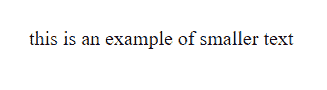
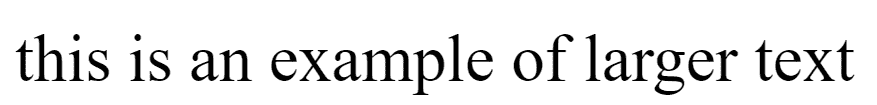

# SVG 字号-调整属性

> 原文:[https://www . geesforgeks . org/SVG-font-size-adjust-attribute/](https://www.geeksforgeeks.org/svg-font-size-adjust-attribute/)

*字体大小调整*属性允许您设置元素的纵横比值，该值将设置给定替代字体中首选字体的 x 高度。该属性根据*字体系列*调整字体大小 x 高度。

**语法:**

```html
font-size-adjust="size"
```

**属性值:**

*   **小数:**我们要调整大小的小数。

我们将使用*字体大小-调整*属性来调整字体的大小。

**例 1:**

## 超文本标记语言

```html
<!DOCTYPE html> 
<html>
<body> 
    <svg width="600" height="80" viewBox="0 0 500 80"
    xmlns="http://www.w3.org/2000/svg">
        <text y="50" x="20" font-family="Times, serif"
              font-size="20px" font-size-adjust="0.50">
            this is an example of smaller text
        </text>
    </svg>
</body> 
</html>
```

**输出:**



**例 2:**

## 超文本标记语言

```html
<!DOCTYPE html> 
<html> 

<body> 
    <svg width="700" height="500" viewBox="0 0 500 800"
         xmlns="http://www.w3.org/2000/svg">
        <text y="50" x="20" font-family="Times, serif" 
              font-size="60px" font-size-adjust="0.50">
            this is an example of larger text
        </text>
    </svg>
</body> 
</html> 
```

**输出:**

