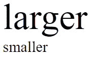

# SVG 字号属性

> 原文:[https://www.geeksforgeeks.org/svg-font-size-attribute/](https://www.geeksforgeeks.org/svg-font-size-attribute/)

**字体大小**属性是指在多行布局环境中多行文本设置为实线时，从基线开始的字体大小。

**语法:**

```html
font-size="size"
```

**属性值:**

*   **长度:**我们要设置大小的长度。
*   **百分比:**我们要设置大小的百分比。

我们将使用字体大小属性来设置字体的大小。

**例 1**

```html
<!DOCTYPE html>
<html>

<body>
    <svg viewBox="0 0 600 100" 
        xmlns="http://www.w3.org/2000/svg">

        <text x="10" y="50" 
            font-size="smaller">
            smaller
        </text>

        <text x="10" y="30" 
            font-size="2em">
            larger
        </text>
    </svg>
</body>

</html>
```

**输出:**



**例 2:**

```html
<!DOCTYPE html>
<html>

<body>
    <svg viewBox="0 0 600 100" 
        xmlns="http://www.w3.org/2000/svg">

        <text x="10" y="50" 
            font-size="60%">
            smaller
        </text>

        <text x="10" y="30" 
            font-size="240%">
            larger
        </text>
    </svg>
</body>

</html>
```

**输出:**

