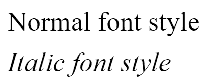
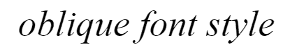

# SVG 字体样式属性

> 原文:[https://www.geeksforgeeks.org/svg-font-style-attribute/](https://www.geeksforgeeks.org/svg-font-style-attribute/)

**字体样式** 属性用于指定文本是使用普通、斜体还是斜面样式渲染。

**语法:**

```html
font-style="style"

```

**属性值:**属性可以有以下值:

*   **正常:**这指定文本应该以正常形式显示。
*   **斜体:**这指定文本应该以斜体形式显示。
*   **倾斜:**这指定文本应该以倾斜的形式显示。

在以下示例中，我们将使用字体样式属性来设置字体的样式:

**例 1:**

## 超文本标记语言

```html
<!DOCTYPE html>
<html>

<body>
    <svg viewBox="0 0 250 300" 
        xmlns="http://www.w3.org/2000/svg">

        <text y="20" x="5" font-size="10px" 
            font-style="normal">
            Normal font style
        </text>

        <text y="35" x="5" font-size="10px" 
            font-style="italic">
            Italic font style
        </text>
    </svg>
</body>

</html>
```

**输出:**



**例 2:**

## 超文本标记语言

```html
<!DOCTYPE html>
<html>

<body>
    <svg viewBox="0 0 250 300" 
        xmlns="http://www.w3.org/2000/svg">

        <text y="15" x="5" font-size="10px" 
            font-style="oblique">
            oblique font style
        </text>
    </svg>
</body>

</html>
```

**输出:**

