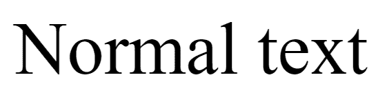
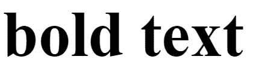

# SVG 字体粗细属性

> 原文:[https://www.geeksforgeeks.org/svg-font-weight-attribute/](https://www.geeksforgeeks.org/svg-font-weight-attribute/)

**字体粗细** 属性是指用于渲染文本的字形相对于同一字体系列中其他字体的粗细程度。

**语法:**

```html
font-variant="variation"
```

**属性值:**

*   **默认值:**默认值正常。
*   **其他值:**其他值加粗、加粗、变浅。

我们将使用字体粗细属性来设置字体的粗细。

**例 1:**

## 超文本标记语言

```html
<!DOCTYPE html>
<html>

<body>
    <svg viewBox="0 0 200 300" 
        xmlns="http://www.w3.org/2000/svg">

        <text x="5" y="20" 
            font-weight="Normal">
            Normal text
        </text>
    </svg>
</body>

</html>
```

**输出:**



**例 2:**

## 超文本标记语言

```html
<!DOCTYPE html>
<html>

<body>
    <svg viewBox="0 0 200 300" 
        xmlns="http://www.w3.org/2000/svg">

        <text x="5" y="20" font-weight="bold">
            bold text
        </text>
    </svg>
</body>

</html>
```

**输出:**

