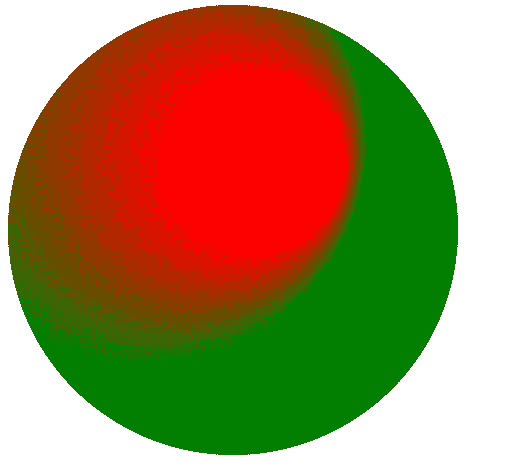

# SVG fr 属性

> 原文:[https://www.geeksforgeeks.org/svg-fr-attribute/](https://www.geeksforgeeks.org/svg-fr-attribute/)

**fr**属性定义了线性渐变的焦点半径。

**语法:**

```html
fr="radius"

```

**属性值:**

*   **长度:**我们要设置半径的长度。
*   **百分比:**我们要设置半径的百分比。

我们将使用 fr 属性来设置元素的半径。

**例 1:**

## 超文本标记语言

```html
<!DOCTYPE html>
<html>

<body>
    <svg viewBox="0 0 600 200" 
        xmlns="http://www.w3.org/2000/svg">

        <defs>
            <radialGradient id="gradient1" 
                cx="0.3" cy="0.3" r="0.5" 
                fx="0.55" fy="0.35" fr="20%">

                <stop offset="0%" stop-color="red" />
                <stop offset="100%" stop-color="green" />
            </radialGradient>
        </defs>

        <circle cx="100" cy="100" r="100" 
            fill="url(#gradient1)" />
    </svg>
</body>

</html>
```

**输出:**



**例 2:**

## 超文本标记语言

```html
<!DOCTYPE html>
<html>

<body>
    <svg viewBox="0 0 600 200" 
        xmlns="http://www.w3.org/2000/svg">

        <defs>
            <radialGradient id="gradient1" 
                cx="0.5" cy="0.5" r="0.5" 
                fx="0.35" fy="0.35" fr="25%">

                <stop offset="0%" stop-color="white" />
                <stop offset="100%" stop-color="green" />
            </radialGradient>
        </defs>

        <circle cx="100" cy="100" r="100" 
            fill="url(#gradient1)" />
    </svg>
</body>

</html>
```

**输出:**

