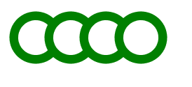
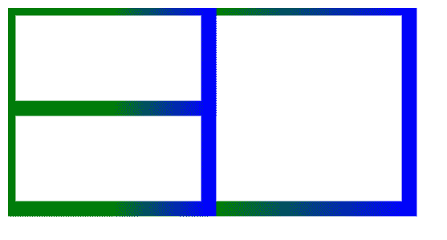

# SVG `<g>`元素

> 原文:[https://www.geeksforgeeks.org/svg-g-element/](https://www.geeksforgeeks.org/svg-g-element/)

**SVG < g >元素**是一个用于对其他 SVG 元素进行分组的容器。

应用于<g>元素的变换也在其子元素上执行，其属性由其子元素继承。</g>

**语法:**

```html
<g attributes="" >
    <elements>
</g>

```

**属性:**

*   **核心属性:**这些属性是 id 等核心属性。
*   **样式属性:**这些属性定义样式、exp、类、样式。
*   **条件属性:**这些属性是基于条件的，exp systemLanguage。
*   **演示属性:**用于给出演示效果、exp 颜色、剪辑规则等的属性。

**示例 1:** 从< g >元素继承属性制作绿色连续圆。

```html
<!DOCTYPE html>
<html>

<body>
    <svg width="1200" height="1200">
        <g fill="white" stroke="green" stroke-width="10">
            <circle cx="40" cy="40" r="25" />
            <circle cx="80" cy="40" r="25" />
            <circle cx="120" cy="40" r="25" />
            <circle cx="160" cy="40" r="25" />
        </g>
    </svg>
</body>

</html>
```

**输出:**



**例 2:** 制作继承属性相同的矩形。

```html
<!DOCTYPE html>
<html>

<body>
    <svg width="1200" height="1200">
        <defs>
            <linearGradient id="gfgStr">
                <stop offset="50%"   stop-color="green" />
                <stop offset="100%" stop-color="blue" />
            </linearGradient>
        </defs>

        <g fill="white" stroke="url(#gfgStr)" stroke-width="15">
            <rect width="400" height="200" />
            <rect width="200" height="200" />
            <rect width="200" height="100" />
        </g>
    </svg>
</body>

</html>
```

**输出:**



**支持的浏览器:**此 SVG 元素支持以下浏览器:

*   铬
*   边缘
*   火狐浏览器
*   旅行队
*   微软公司出品的 web 浏览器
*   歌剧