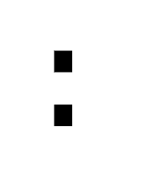

# SVG 高度属性

> 原文:[https://www.geeksforgeeks.org/svg-height-attribute/](https://www.geeksforgeeks.org/svg-height-attribute/)

**高度**属性定义元素的垂直长度。

**语法:**

```html
height= "height"
```

**属性值:**

*   **长度:**我们要设置高度属性的长度
*   **百分比:**我们要设置高度属性的百分比

我们将使用 height 属性来设置元素的高度。

**示例 1:** 在本例中，我们将使用 height 属性来使用 length 值设置 rect 的高度。

```html
<!DOCTYPE html>
<html>

<body>
    <svg viewBox="0 0 3000 1000" 
        xmlns="http://www.w3.org/2000/svg">

        <rect y="150" x="150" 
            width="50" height="60" />

        <rect y="300" x="150" 
            width="50" height="60" />
    </svg>
</body>

</html>
```

**输出:**



**示例 2:** 在本例中，我们将使用高度属性来使用百分比值设置矩形的高度。

```html
<!DOCTYPE html>
<html>

<body>
    <svg viewBox="0 0 3000 1000" 
        xmlns="http://www.w3.org/2000/svg">

        <rect y="150" x="75" 
            width="12%" height="10%" />

        <rect y="300" x="75" 
            width="12%" height="10%" />
    </svg>
</body>

</html>
```

**输出**

