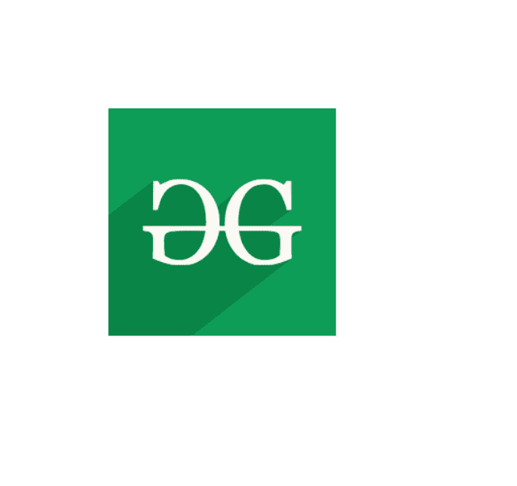

# SVG `<image>`标签

> 哎哎哎:# t0]https://www . geeksforgeeks . org/SVG-image tag/

SVG 代表可缩放矢量图形。它可以用来制作像在 HTML 画布中的图形和动画。

**<图像>** SVG 元素包括 SVG 文档内部的图像。它可以显示光栅图像文件或其他 SVG 文件。SVG 软件必须支持的唯一图像格式是 JPEG、PNG 和其他 SVG 文件。

**语法:**

```html
<image attributes="values" >

```

**属性:**

*   **x:** 图像的 x 轴坐标定位。
*   **y:** 图像的 y 轴坐标定位。
*   **宽度:**图像的宽度。
*   **高度**:图像的高度。
*   **href:** 图像的来源。
*   **保存预期比率:**图像缩放。
*   **全局属性:**使用了一些全局属性，如核心属性、造型属性等。

**例 1:**

## 超文本标记语言

```html
<!DOCTYPE html>
<html>

<body>
    <svg width="200" height="200"
        xmlns="http://www.w3.org/2000/svg">       
        <image 
            href=
"https://media.geeksforgeeks.org/wp-content/cdn-uploads/20190710102234/download3.png" 
            height="200" width="200"/>
    </svg>
</body>

</html>
```

**输出:**


**例 2:** 改变图像的 x、y 坐标。

## 超文本标记语言

```html
<!DOCTYPE html>
<html>

<body>
    <svg width="400" height="400"
        xmlns="http://www.w3.org/2000/svg">       
        <image 
            href=
"https://media.geeksforgeeks.org/wp-content/cdn-uploads/20190710102234/download3.png" 
            x="100" y="100" />
    </svg>
</body>

</html>
```

**输出:**



**支持的浏览器:**

*   铬
*   边缘
*   火狐浏览器
*   旅行队
*   微软公司出品的 web 浏览器
*   歌剧