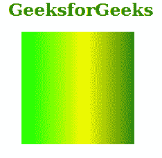

# SVG 截距属性

> 原文:[https://www.geeksforgeeks.org/svg-intercept-attribute/](https://www.geeksforgeeks.org/svg-intercept-attribute/)

*截距*属性用于指定颜色分量线性函数的截距。应该注意的是，类型属性被设置为线性。使用该属性的元素包括:*<feFuncA><feFuncB><feFuncG>*和 *< feFuncR >。*

**语法:**

```html
intercept = "number"
```

**属性值:***截距*属性接受上面提到的和下面描述的值

*   **数字:**这定义了一个整数或一个带有分数部分的数字。

**注意:***截距*属性的默认值为 0。

下面的例子说明了*截取*属性的使用。

**例 1:**

## 超文本标记语言

```html
<!DOCTYPE html>
<html>

<body>
    <h1 style="color: green; margin-left: 35px;">
        GeeksforGeeks
    </h1>

    <svg viewBox="-60 0 1420 200" 
        xmlns="http://www.w3.org/2000/svg">

        <defs>
            <linearGradient id="geeky" 
                gradientUnits="userSpaceOnUse" 
                x1="0" y1="0" x2="200" y2="0">

                <stop offset="0" stop-color="#00ff00" />
                <stop offset="0.5" stop-color="yellow" />
                <stop offset="1" stop-color="darkgreen" />
            </linearGradient>
        </defs>

        <filter id="geek1" width="100%" height="100%">
            <feComponentTransfer>
                <feFuncR type="linear" intercept="0" />
                <feFuncG type="linear" intercept="0" />
                <feFuncB type="linear" intercept="0" />
            </feComponentTransfer>
        </filter>

        <rect width="200" height="200" 
            fill="url(#geeky)" 
            style="filter:url(#geek1);" />
    </svg>
</body>

</html>
```

**输出:**



**例 2:**

## 超文本标记语言

```html
<!DOCTYPE html>
<html>

<body>
    <h1 style="color: green; margin-left: 35px;">
        GeeksforGeeks
    </h1>

    <svg viewBox="-60 0 1420 200" 
        xmlns="http://www.w3.org/2000/svg">

        <defs>
            <linearGradient id="geeky" 
                gradientUnits="userSpaceOnUse" 
                x1="0" y1="0" x2="200" y2="0">

                <stop offset="0" stop-color="green" />
                <stop offset="0.5" stop-color="#FDBF2D" />
                <stop offset="1" stop-color="#FF0000" />
            </linearGradient>
        </defs>

        <filter id="geek2" width="100%" height="100%">
            <feComponentTransfer>
                <feFuncR type="linear" intercept="0.1" />
                <feFuncG type="linear" intercept="0.1" />
                <feFuncB type="linear" intercept="0.1" />
            </feComponentTransfer>
        </filter>

        <rect width="200" height="200" 
            fill="url(#geeky)" 
            style="filter: url(#geek2);" />
    </svg>
</body>

</html>
```

**输出:**

