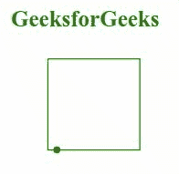

# 奇异值分解关键点属性

> 原文:[https://www.geeksforgeeks.org/svg-keypoints-attribute/](https://www.geeksforgeeks.org/svg-keypoints-attribute/)

*关键点*属性指定动画的持续时间。使用该属性的元素包括: *<动画><动画生态器><动画情感><动画转换>*和 *<设置>。*

**语法:**

```html
keyPoints = [;<number>]*
```

**属性值:***关键点*属性接受上面提到的和下面描述的值

*   **【；<数字> ]*:** 这是一个由分号分隔的 0 到 1 之间的数字列表。

**注意:***<u>关键点</u>* 属性的默认值为无

以下示例说明了*关键点*属性的使用。

**例 1:**

## 超文本标记语言

```html
<!DOCTYPE html>
<html>

<body>
    <h1 style="color: green; margin-left: 35px;">
        GeeksforGeeks
    </h1>

    <svg viewBox="-50 0 1020 120" 
        xmlns="http://www.w3.org/2000/svg" 
        xmlns:xlink="http://www.w3.org/1999/xlink">

        <path d="M 10 10 H 90 V 90 H 10 L 10 10"
        stroke="green" fill="none" id="geek"/>

        <circle r="3" fill="green">
            <animateMotion dur="3s"
                repeatCount="indefinite"
                keyPoints="0;0.5;1"
                keyTimes="0;0.15;1"
                calcMode="linear">
                <mpath xlink:href="#geek"/>
            </animateMotion>
        </circle>
    </svg>
</body>

</html>
```

**输出:**



**例 2:**

## 超文本标记语言

```html
<!DOCTYPE html>
<html>

<body>
    <h1 style="color: green; margin-left: 35px;">
        GeeksforGeeks
    </h1>

    <svg viewBox="-30 40 1020 120" 
        xmlns="http://www.w3.org/2000/svg" 
        xmlns:xlink="http://www.w3.org/1999/xlink">

        <path d="M50,50 Q50,100 100,100"
            stroke="green" fill="none" id="geek"/>

            <circle r="5" fill="green">
                <animateMotion dur="3s"
                    repeatCount="indefinite"
                    keyPoints="0;0.5;1"
                    keyTimes="0;0.15;1"
                    calcMode="linear">
                    <mpath xlink:href="#geek"/>
                </animateMotion>
            </circle>
    </svg>
</body>

</html>
```

**输出:**

