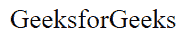

# SVG lang 属性

> 原文:[https://www.geeksforgeeks.org/svg-lang-attribute/](https://www.geeksforgeeks.org/svg-lang-attribute/)

**lang** 属性用于指定元素中使用的语言

**语法:**

```html
lang="language"
```

**属性值:**

*   **语言:**语言属性用于指定语言。

我们将使用 lang 属性来指定语言。

**例 1:** 在本例中，我们将使用 lang 属性来表示英语。

## 超文本标记语言

```html
<!DOCTYPE html>
<html>

<body>
    <svg viewBox="0 0 1000 250" 
        xmlns="http://www.w3.org/2000/svg">

        <text x="5" y="35" lang="en-US" 
            font-size="20px">
            GeeksforGeeks
        </text>
    </svg>
</body>

</html>
```

**输出:**



**例 2:** 在本例中，我们将使用 lang 属性来表示德语。

## 超文本标记语言

```html
<!DOCTYPE html>
<html>

<body>
    <svg viewBox="0 0 1000 250" 
        xmlns="http://www.w3.org/2000/svg">

        <text x="5" y="35" lang="de-AT" 
            font-size="20px">
            Hallo, Willkommen bei geeksforgeeks
        </text>
    </svg>
</body>

</html>
```

**输出:**

