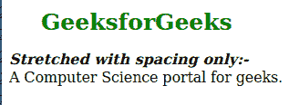
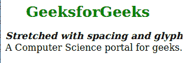
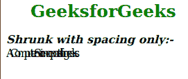
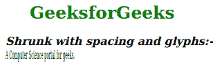

# SVG 长度调整属性

> 原文:[https://www.geeksforgeeks.org/svg-lengthadjust-attribute/](https://www.geeksforgeeks.org/svg-lengthadjust-attribute/)

*长度调整*属性用于决定文本在*文本长度*属性定义的长度内的拉伸。使用该属性的元素有 *<文本><文本路径><tref>T5】和 *< tspan >。**

**语法:**

```html
lengthAdjust = spacing | spacingAndGlyphs
```

**属性值:***长度调整*属性接受上面提到的和下面描述的值。

*   **间距:**它会调整字形之间的间距，但不会拉伸或挤压字形本身。
*   **间距和字形:**它将调整字形之间的间距和字形大小。

**注意:***长度调整*属性的默认值为间距。

下面的例子说明了*长度调整*属性的使用。

**例 1:**

## 超文本标记语言

```html
<!DOCTYPE html>
<html>

<head>
    <style>
        .geek {
            font-style: italic;
            font-weight: bold;
        }
    </style>
</head>

<body>
    <h1 style="color: green; 
            margin-left: 35px;
            font-size: 25px;">
        GeeksforGeeks
    </h1>

    <svg xmlns="http://www.w3.org/2000/svg">
        <g>
            <text class="geek" x="0" y="15">
                Stretched with spacing only:-
            </text>

            <text x="0" y="35" textLength="300" 
                lengthAdjust="spacing">
                A Computer Science
                portal for geeks.
            </text>
        </g>
    </svg>
</body>

</html>
```

**输出:**



**例 2:**

## 超文本标记语言

```html
<!DOCTYPE html>
<html>

<head>
    <style>
        .geek {
            font-style: italic;
            font-weight: bold;
        }
    </style>
</head>

<body>
    <h1 style="color: green; 
            margin-left: 35px;
            font-size: 25px;">
        GeeksforGeeks
    </h1>

    <svg xmlns="http://www.w3.org/2000/svg">
        <g>
            <text class="geek" x="0" y="15">
                Stretched with spacing
                and glyphs:-
            </text>

            <text x="0" y="35" textLength="300"
                lengthAdjust="spacingAndGlyphs">
                A Computer Science
                portal for geeks.
            </text>
        </g>
    </svg>
</body>

</html>
```

**输出:**



**例 3:**

## 超文本标记语言

```html
<!DOCTYPE html>
<html>

<head>
    <style>
        .geek {
            font-style: italic;
            font-weight: bold;
        }
    </style>
</head>

<body>
    <h1 style="color: green; 
            margin-left: 35px;
            font-size: 25px;">
        GeeksforGeeks
    </h1>

    <svg xmlns="http://www.w3.org/2000/svg">
        <g>
            <text class="geek" x="0" y="15">
                Shrunk with spacing only:-
            </text>

            <text x="0" y="35" textLength="100"
                lengthAdjust="spacing">
                A Computer Science
                portal for geeks.
            </text>
        </g>
    </svg>
</body>

</html>
```

**输出:**



**例 4:**

## 超文本标记语言

```html
<!DOCTYPE html>
<html>

<head>
    <style>
        .geek {
            font-style: italic;
            font-weight: bold;
        }
    </style>
</head>

<body>
    <h1 style="color: green; 
            margin-left: 35px;
            font-size: 25px;">
        GeeksforGeeks
    </h1>

    <svg xmlns="http://www.w3.org/2000/svg">
        <g>
            <text class="geek" x="0" y="15">
                Shrunk with spacing
                and glyphs:-
            </text>
            <text x="0" y="35" textLength="100"
                lengthAdjust="spacingAndGlyphs">
                A Computer Science
                portal for geeks.
            </text>
        </g>
    </svg>
</body>

</html>
```

**输出:**

