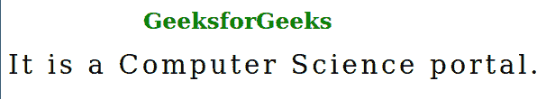
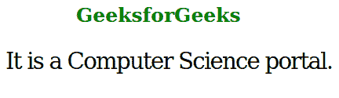

# SVG 字母间距属性

> 原文:[https://www.geeksforgeeks.org/svg-letter-spacing-attribute/](https://www.geeksforgeeks.org/svg-letter-spacing-attribute/)

*字母间距*属性控制文本字符之间的间距，即增加或减少文本中字符之间的间距。

**语法:**

```html
letter-spacing = keyword-values | length-values | global-values
```

**属性值:**字母间距属性接受上面提到的和下面描述的三个值:

*   **关键字-值:**该属性值包括像*正常*这样的值。
*   **长度值:**该属性值包括 *em、px 等值。*
*   **全局值:**该属性值包括*继承、初始、*和*取消设置等值。*

**注意:**字母间距默认值为*正常*。

以下示例说明了*字母间距*属性在 SVG 中的使用。

**例 1:**

## 超文本标记语言

```html
<!DOCTYPE html>
<html>

<body>
    <h1 style="color: green; 
              margin-left: 150px;
              font-size: 25px;">
        GeeksforGeeks
    </h1>

    <svg viewBox="0 5 700 30" 
        xmlns="http://www.w3.org/2000/svg">

        <text y="20" letter-spacing="2">
            It is a Computer Science portal.
        </text>
    </svg>
</body>

</html>
```

**输出:**



**例 2:**

## 超文本标记语言

```html
<!DOCTYPE html>
<html>

<body>
    <h1 style="color: green; 
            margin-left: -5px;
            font-size: 25px;">
        GeeksforGeeks
    </h1>

    <svg viewBox="0 0 700 30" 
        xmlns="http://www.w3.org/2000/svg">

        <text y="20" letter-spacing="-1">
            It is a Computer Science portal.
        </text>
    </svg>
</body>

</html>
```

**输出:**

