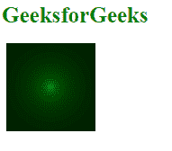
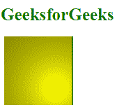

# SVG 灯光-颜色属性

> 原文:[https://www.geeksforgeeks.org/svg-lighting-color-attribute/](https://www.geeksforgeeks.org/svg-lighting-color-attribute/)

*灯光颜色*属性表示灯光滤镜图元的光源颜色。使用该属性的元素包括*T6【费氏照明】T7*和*T8【费氏照明】T9*

**语法:**

```html
lighting-color ="color"
```

**属性值:***亮色*属性接受上面提到的和下面描述的值

*   **颜色:**代表元素的装饰和文字部分。

**注意:***亮色*的默认值为白色。

下面的例子说明了*亮色*属性的使用。

**例 1:**

```html
<!DOCTYPE html> 
<html> 

    <body> 
        <h1 style="color: green; 
            margin-left: -5px;
            font-size: 25px;"> 
            GeeksforGeeks 
        </h1> 
        <svg viewBox="0 0 1280 200" 
             xmlns="http://www.w3.org/2000/svg">

             <filter id="geek1" x="0" y="0" 
                width="100%" height="100%">
                <feDiffuseLighting in="SourceGraphic" 
                  lighting-color="green">
                  <fePointLight x="100" y="100" z="10"/>
                </feDiffuseLighting>
              </filter>

              <rect width="200" height="200" 
                    style="filter: url(#geek1);"/>
          </svg>
    </body>

</html>
```

**输出:**



**例 2:**

```html
<!DOCTYPE html> 
<html> 

    <body> 
        <h1 style="color: green; 
            margin-left: -5px;
            font-size: 25px;"> 
            GeeksforGeeks 
        </h1> 
        <svg viewBox="0 0 1280 200" 
             xmlns="http://www.w3.org/2000/svg">

             <filter id="geek2" x="0" y="0" 
                 width="100%" height="100%">
                <feDiffuseLighting in="SourceGraphic" 
                   lighting-color="yellow">
                  <fePointLight x="150" y="150" z="60"/>
                </feDiffuseLighting>
              </filter>

              <rect width="200" height="200" 
                    style="filter: url(#geek2);"/>
          </svg>
    </body>

</html>
```

**输出:**

