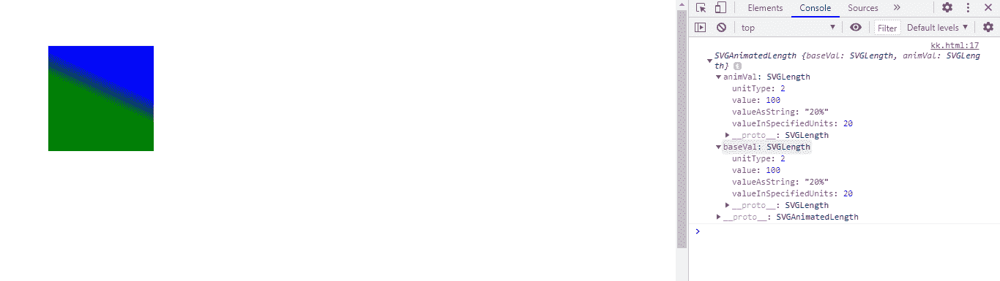

# SVG 线性梯度元素. x2 属性

> 原文:[https://www . geesforgeks . org/SVG-linear gradient element-x2-property/](https://www.geeksforgeeks.org/svg-lineargradientelement-x2-property/)

**SVG LinearGradientElement.x2 属性**返回一个对应于给定 LinearGradient 元素属性的 SVGAnimatedLength 对象。

**语法:**

```html
LinearGradientElement.x2
```

**返回值:**这个属性返回一个可用于获取线性渐变元素的对象。

**例 1:**

```html
<!DOCTYPE html>
<html>

<body>
    <svg viewBox="0 0 200 200" 
         xmlns="http://www.w3.org/2000/svg"
     xmlns:xlink="http://www.w3.org/1999/xlink">
  <defs>
    <linearGradient id="gfg" gradientTransform="rotate(70)"
                    x1="0%" x2="20%" y1="0%" y2="20%">
      <stop offset="10%"  stop-color="blue" />
      <stop offset="90%" stop-color="green" />
    </linearGradient>
  </defs>

  <circle cx="20" cy="20" r="20" fill="url('#gfg')" />
      <script>
          var a=document.getElementById("gfg");
          console.log(a.x2);
      </script>
</svg>
</body>

</html>
```

**输出:**


**例 2:**

```html
<!DOCTYPE html>
<html>

<body>
    <svg viewBox="0 0 500 500" 
         xmlns="http://www.w3.org/2000/svg"
     xmlns:xlink="http://www.w3.org/1999/xlink">
  <defs>
    <linearGradient id="gfg" 
                    gradientTransform="rotate(70)"
                    x1="0%" x2="20%" y1="0%" y2="20%">
      <stop offset="10%"  stop-color="blue" />
      <stop offset="90%" stop-color="green" />
    </linearGradient>
  </defs>

  <ellipse cx="100" cy="70" rx="80" 
           ry="50" fill="url('#gfg')" />
      <script>
          var a=document.getElementById("gfg");
          console.log(a.x2);
      </script>
</svg>
</body>

</html>
```

**输出:**


**例 3:**

```html
<!DOCTYPE html>
<html>

<body>
    <svg viewBox="0 0 500 500" 
         xmlns="http://www.w3.org/2000/svg"
     xmlns:xlink="http://www.w3.org/1999/xlink">
  <defs>
    <linearGradient id="gfg" 
                    gradientTransform="rotate(70)" 
                    x1="0%" x2="20%" 
                    y1="0%" y2="20%">
      <stop offset="10%"  stop-color="blue" />
      <stop offset="90%" stop-color="green" />
    </linearGradient>
  </defs>

  <rect height="80" width="80" x="30"
        y="30" fill="url('#gfg')" />
      <script>
          var a=document.getElementById("gfg");
          console.log(a.x2);
      </script>
</svg>
</body>

</html>
```

**输出:**

