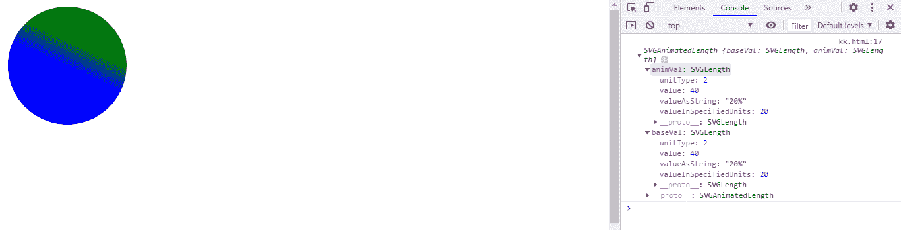
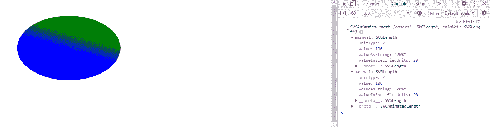
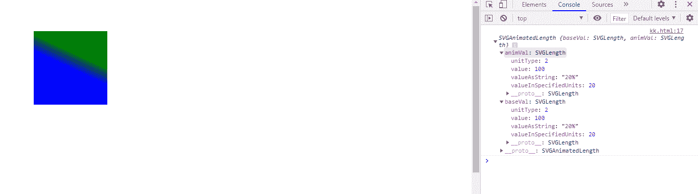

# SVG 线性梯度元件. y1

> 哎哎哎::1230【https://www . geeksforgeeks . org/SVG-linear gradientelement-y1/

属性返回一个对应于给定线性渐变元素属性的对象。

**语法:**

```html
LinearGradientElement.y1
```

**返回值:**该属性返回一个可用于获取线性渐变元素 y1 的对象

**例 1:**

```html
<!DOCTYPE html>
<html>

<body>
    <svg viewBox="0 0 200 200" 
         xmlns="http://www.w3.org/2000/svg"
     xmlns:xlink="http://www.w3.org/1999/xlink">
  <defs>
    <linearGradient id="gfg" 
                    gradientTransform="rotate(70)" 
                    x1="20%" x2="0%" 
                    y1="20%" y2="0%">
      <stop offset="10%"  stop-color="blue" />
      <stop offset="90%" stop-color="green" />
    </linearGradient>
  </defs>

  <circle cx="20" cy="20" r="20" fill="url('#gfg')" />
      <script>
          var a=document.getElementById("gfg");
          console.log(a.y1);
      </script>
</svg>
</body>

</html>
```

**输出:**



**例 2:**

```html
<!DOCTYPE html>
<html>

<body>
    <svg viewBox="0 0 500 500"
         xmlns="http://www.w3.org/2000/svg"
     xmlns:xlink="http://www.w3.org/1999/xlink">
  <defs>
    <linearGradient id="gfg" 
            gradientTransform="rotate(70)" 
            x1="20%" x2="0%"
            y1="20%" y2="0%">
      <stop offset="10%"  stop-color="blue" />
      <stop offset="90%" stop-color="green" />
    </linearGradient>
  </defs>

  <ellipse cx="100" cy="70" rx="80" 
           ry="50" fill="url('#gfg')" />
      <script>
          var a=document.getElementById("gfg");
          console.log(a.y1);
      </script>
</svg>
</body>

</html>
```

**输出:**



**例 3:**

```html
<!DOCTYPE html>
<html>

<body>
    <svg viewBox="0 0 500 500"
         xmlns="http://www.w3.org/2000/svg"
     xmlns:xlink="http://www.w3.org/1999/xlink">
  <defs>
    <linearGradient id="gfg" 
                    gradientTransform="rotate(70)" 
                    x1="20%" x2="0%" 
                    y1="20%" y2="0%">
      <stop offset="10%"  stop-color="blue" />
      <stop offset="90%" stop-color="green" />
    </linearGradient>
  </defs>

  <rect height="80" width="80"
        x="30" y="30" fill="url('#gfg')" />
      <script>
          var a=document.getElementById("gfg");
          console.log(a.y1);
      </script>
</svg>
</body>

</html>
```

**输出:**

