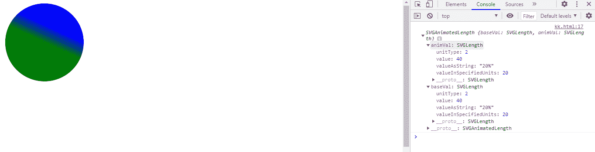
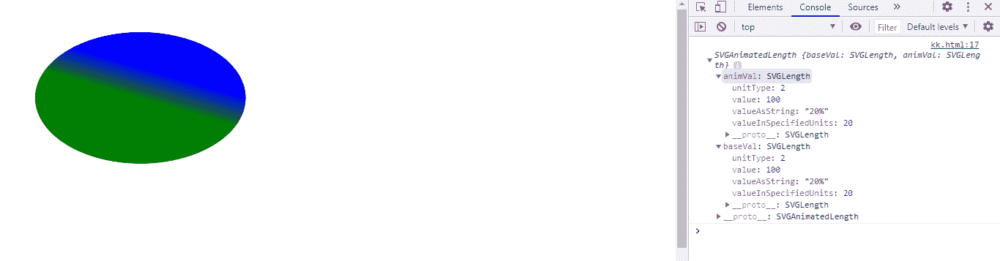
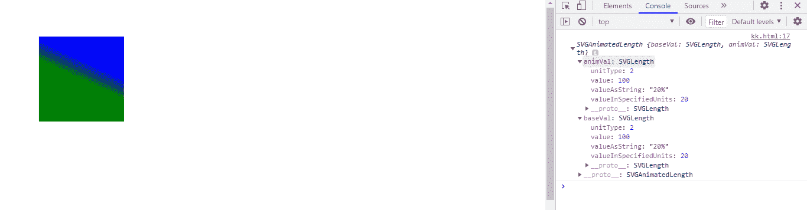

# SVG 线性梯度元素 2 属性

> 原文:[https://www . geesforgeks . org/SVG-linear gradient element-y2-property/](https://www.geeksforgeeks.org/svg-lineargradientelement-y2-property/)

**SVG LinearGradientElement.y2 属性** 返回一个对应于给定 LinearGradient 元素属性的 SVGAnimatedLength 对象

**语法:**

```html
LinearGradientElement.y2
```

**返回值:**该属性返回svganimatellength 对象，该对象可用于获取线性渐变元素的 y2。

**例 1:**

## 超文本标记语言

```html
<!DOCTYPE html>
<html>

<body>
    <svg viewBox="0 0 200 200" 
        xmlns="http://www.w3.org/2000/svg" 
        xmlns:xlink="http://www.w3.org/1999/xlink">

        <defs>
            <linearGradient id="gfg" 
                gradientTransform="rotate(70)" 
                x1="0%" x2="20%" y1="0%" y2="20%">

                <stop offset="10%" stop-color="blue" />
                <stop offset="90%" stop-color="green" />
            </linearGradient>
        </defs>

        <circle cx="20" cy="20" r="20" fill="url('#gfg')" />

        <script>
            var a = document.getElementById("gfg");
            console.log(a.y2);
        </script>
    </svg>
</body>

</html>
```

**输出:**



**例 2:**

## 超文本标记语言

```html
<!DOCTYPE html>
<html>

<body>
    <svg viewBox="0 0 500 500" 
        xmlns="http://www.w3.org/2000/svg" 
        xmlns:xlink="http://www.w3.org/1999/xlink">

        <defs>
            <linearGradient id="gfg" 
                gradientTransform="rotate(70)" 
                x1="0%" x2="20%" y1="0%" y2="20%">

                <stop offset="10%" stop-color="blue" />
                <stop offset="90%" stop-color="green" />
            </linearGradient>
        </defs>

        <ellipse cx="100" cy="70" rx="80" 
            ry="50" fill="url('#gfg')" />

        <script>
            var a = document.getElementById("gfg");
            console.log(a.y2);
        </script>
    </svg>
</body>

</html>
```

**输出:**



**例 3:**

## 超文本标记语言

```html
<!DOCTYPE html>
<html>

<body>
    <svg viewBox="0 0 500 500" 
        xmlns="http://www.w3.org/2000/svg" 
        xmlns:xlink="http://www.w3.org/1999/xlink">

        <defs>
            <linearGradient id="gfg" 
                gradientTransform="rotate(70)" 
                x1="0%" x2="20%" y1="0%" y2="20%">

                <stop offset="10%" stop-color="blue" />
                <stop offset="90%" stop-color="green" />
            </linearGradient>
        </defs>

        <rect height="80" width="80" x="30" 
            y="30" fill="url('#gfg')" />

        <script>
            var a = document.getElementById("gfg");
            console.log(a.y2);
        </script>
    </svg>
</body>

</html>
```

**输出:**

