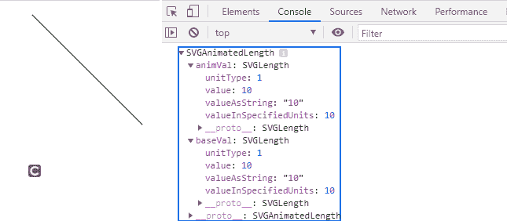
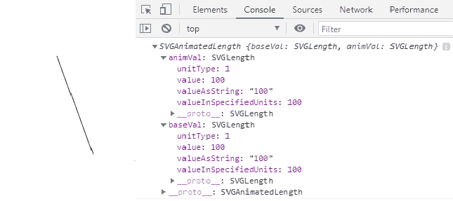

# SVG LineElement.x1 属性

> 原文:[https://www.geeksforgeeks.org/svg-lineelement-x1-property/](https://www.geeksforgeeks.org/svg-lineelement-x1-property/)

**SVG LineElement.x1** 属性返回一个与给定行元素的属性相对应的**svorganimatedlength**对象。

**语法:**

```html
LineElement.x1

```

**返回值:**该属性返回 **SVGAnimatedLength** 对象，可用于获取行元素的“x1”。

**例 1:**

## 超文本标记语言

```html
<!DOCTYPE html>
<html>

<body>
    <svg width="350" height="350" 
        xmlns="http://www.w3.org/2000/svg">

        <line x1="10" x2="150" y1="10" 
            y2="150" id="gfg" stroke="green" />

        <script>
            var g = document.getElementById("gfg");
            console.log(g.x1);
        </script>
    </svg>
</body>

</html>
```

**输出:**



**例 2:**

## 超文本标记语言

```html
<!DOCTYPE html>
<html>

<body>
    <svg width="350" height="350" 
        xmlns="http://www.w3.org/2000/svg">

        <line x1="100" x2="150" y1="10" 
            y2="150" id="gfg" stroke="green" />

        <script>
            var g = document.getElementById("gfg");
            console.log(g.x1)
        </script>
    </svg>
</body>

</html>
```

**输出:**

