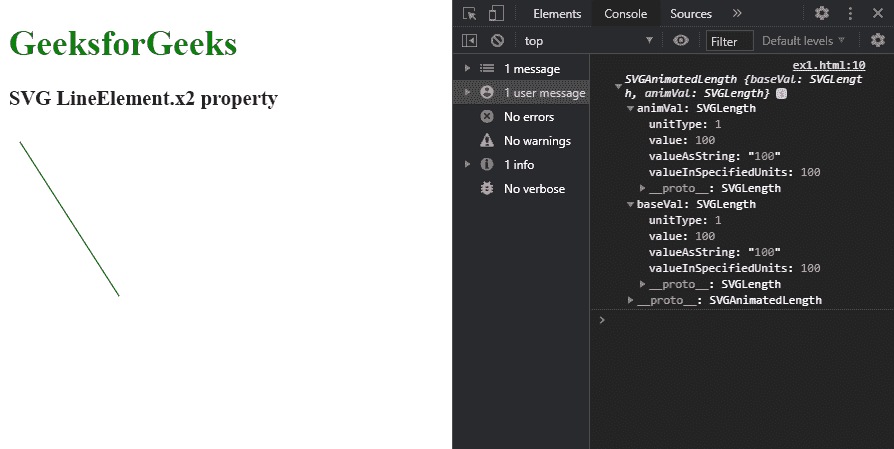
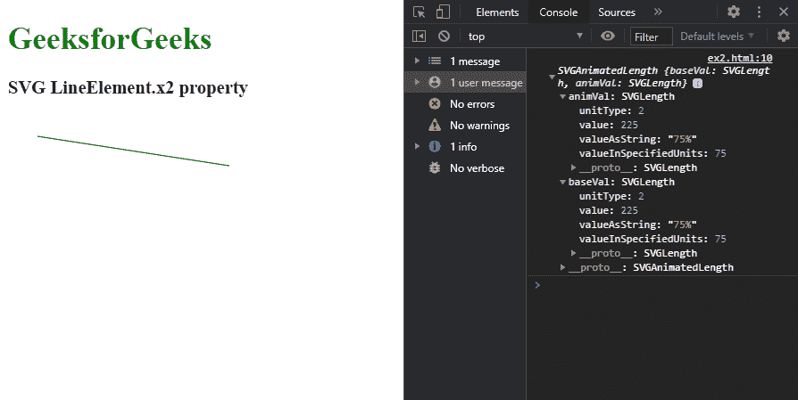

# SVG LineElement.x2 属性

> 原文:[https://www.geeksforgeeks.org/svg-lineelement-x2-property/](https://www.geeksforgeeks.org/svg-lineelement-x2-property/)

**SVG LineElement.x2 属性**用于 **r** 设置对应于给定 lin e 元素属性的 SVGAnimatedLength 对象。

**语法:**

```html
LineElement.x2

```

**返回值:**该属性返回一个 SVGAnimatedLength 对象，该对象可用于获取线元素的“x2”值和其他属性。

**例 1:**

## 超文本标记语言

```html
<!DOCTYPE html>
<html>

<body>
    <h1 style="color: green">
        GeeksforGeeks
    </h1>

    <h3>SVG LineElement.x2 property</h3>

    <svg width="300" height="200" 
        xmlns="http://www.w3.org/2000/svg">

        <line x1="10" x2="100" y1="10" 
            y2="150" id="gfg" stroke="green" />

        <script>
            var g = document.getElementById("gfg");
            console.log(g.x2)
        </script>
    </svg>
</body>

</html>
```

**输出:**



**例 2:**

## 超文本标记语言

```html
<!DOCTYPE html>
<html>

<body>
    <h1 style="color: green">
        GeeksforGeeks
    </h1>

    <h3>SVG LineElement.x2 property</h3>

    <svg width="300" height="200" 
        xmlns="http://www.w3.org/2000/svg">

        <line x1="10%" x2="75%" y1="10%" 
            y2="25%" id="gfg" stroke="green" />

        <script>
            var g = document.getElementById("gfg");
            console.log(g.x2)
        </script>
    </svg>
</body>

</html>
```

**输出:**

