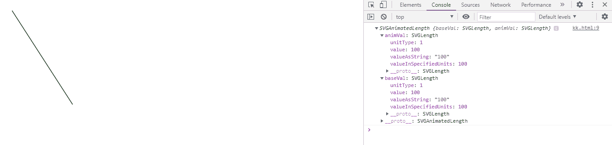
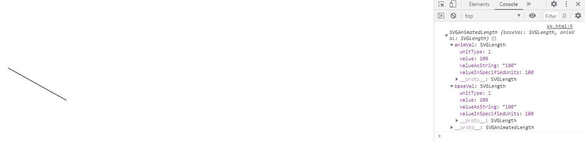

# SVG 线元素. y1 性质

> 原文:[https://www.geeksforgeeks.org/svg-lineelement-y1-property/](https://www.geeksforgeeks.org/svg-lineelement-y1-property/)

**SVG LineElement.y1 属性** 返回一个对应于给定 lin e 元素属性的 SVGAnimatedLength 对象

**语法:**

```html
LineElement.y1
```

**返回值:**该属性返回svorganimatedlength 对象，该对象可用于获取线元素的 y1

**例 1:**

## 超文本标记语言

```html
<!DOCTYPE html>
<html>

<body>
    <svg width="350" height="350" 
        xmlns="http://www.w3.org/2000/svg">

        <line x1="10" x2="100" y1="10" y2="150" 
            id="gfg" stroke="green" />

        <script>
            var g = document.getElementById("gfg");
            console.log(g.y1)
        </script>
    </svg>
</body>

</html>
```

**输出:**



**例 2:**

## 超文本标记语言

```html
<!DOCTYPE html>
<html>

<body>
    <svg width="350" height="350" 
        xmlns="http://www.w3.org/2000/svg">

        <line x1="10" x2="100" y1="100" 
            y2="150" id="gfg" stroke="green" />

        <script>
            var g = document.getElementById("gfg");
            console.log(g.y1)
        </script>
    </svg>
</body>

</html>
```

**输出:**

