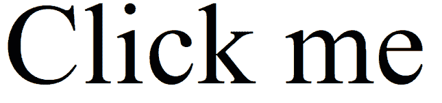
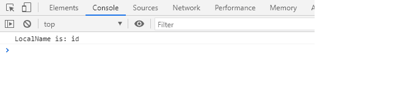
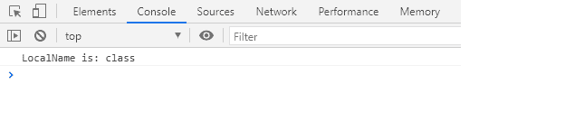

# SVG 本地名称属性

> 原文:[https://www.geeksforgeeks.org/svg-localname-property/](https://www.geeksforgeeks.org/svg-localname-property/)

SVG `<em>` localName 属性返回给定 Attr 元素的 localName。

**语法:**

```html
name = attribute.localName

```

**返回值:**该属性返回 Attr 的 localName。

**例 1:**

## 超文本标记语言

```html
<!DOCTYPE html>
<html>

<body>
    <svg viewBox="0 0 100 100" 
        xmlns="http://www.w3.org/2000/svg">

        <!-- A link around a text -->
        <text id="example" x="20" y="20">
            Click me
        </text>

        <script>
            const element = document
                .querySelector("#example");

            const attribute = element.attributes[0];

            console.log('LocalName is:', 
                    attribute.localName);
        </script>
    </svg>
</body>

</html>
```

**输出:**




**例 2:**

## 超文本标记语言

```html
<!DOCTYPE html>
<html>

<body>
    <svg viewBox="0 0 100 100" 
        xmlns="http://www.w3.org/2000/svg">

        <!-- A link around a shape -->
        <circle class="gfg" cx="20" 
            cy="20" r="15">
            Click me
        </circle>

        <script>
            const element = document.querySelector(".gfg");
            const attribute = element.attributes[0];
            console.log('LocalName is:', attribute.localName);
        </script>
    </svg>
</body>

</html>
```

**输出:**




**参考:**[https://developer . Mozilla . org/en-US/docs/Web/API/Attr/local name](https://developer.mozilla.org/en-US/docs/Web/API/Attr/localName)