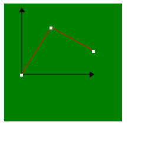
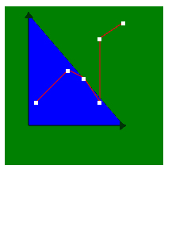

# SVG 标记元素

> 原文:[https://www.geeksforgeeks.org/svg-marker-element/](https://www.geeksforgeeks.org/svg-marker-element/)

SVG 中的 **<标记>** 元素用于定义主要用于绘图目的的图形。它可以用于在给定路径上制作箭头和多边形标记的图形、图表中。

**语法:**

```html
<marker></marker refX="" viewbox="" refY="" markerWidth="" markerHeight="" orient="">
```

**属性值:**该元素包含以下属性:

*   **refX:** 给出标记 x 坐标的参考。
*   **refY:** 给出标记的 y 坐标的参考。
*   **视图框:**视图框给出了当前 SVG 的 SVG 视口边界的详细信息。
*   **方向:**定义标记的方向。
*   **标记宽度:**该属性定义标记视口的宽度。
*   **标记灯:**该属性定义标记视口的高度。

下面是上面给出的函数的几个例子。

**示例 1:**

## 超文本标记语言

```html
<!DOCTYPE html>
<html lang="en">
<head>
    <meta charset="UTF-8">
    <meta name="viewport"
            path1tent="width=device-width,
                    initial-scale=1.0">
    <title>Document</title>
</head>
<style>
svg{
    width: 200px;
    height: 200px;
    color: black;
    background-color: green;
}
</style>
<body>
    <svg>
        <defs>
          <marker id="arrow"
                  refX="5"
                  refY="5"
                   markerWidth="10"
                  markerHeight="16"
                   orient="auto-start-reverse">
            <path d="M 0 0 L 8 5 L 0 11 z" />
          </marker>

          <marker id="dot"
                  refX="5"
                  refY="5"
                   markerWidth="15"
                  markerHeight="15">
            <rect width="5"
                  height="5"
                  x="2"
                  y="4"
                  fill="white" />
          </marker>
        </defs>

        <polyline points="30, 10 30, 120 150, 120"
                  fill="none"
                  stroke="black"
                   marker-start="url(#arrow)"
                  marker-end="url(#arrow)"  />

        <polyline points="30, 120 80, 40 152, 80"
                  fill="none"
                  stroke="red"
                   marker-start="url(#dot)"
                  marker-mid="url(#dot)" 
                  marker-end="url(#dot)" />
      </svg>
</body>
</html>
```

**输出:**



**例 2:**

## 超文本标记语言

```html
<!DOCTYPE html>
<html lang="en">
<head>
    <meta charset="UTF-8">
    <meta name="viewport"
            path1tent="width=device-width,
                    initial-scale=1.0">
    <title>Document</title>
</head>
<style>
svg{
    width: 200px;
    height: 200px;
    color: black;
    background-color: green;
}
</style>
<body>
    <svg>
        <defs>
          <marker id="arrow"
                  refX="5"
                  refY="5"
                    markerWidth="10"
                  markerHeight="16"
                    orient="auto-start-reverse">
            <path d="M 0 0 L 8 5 L 0 11 z" />
          </marker>

          <marker id="dot"
                  refX="5"
                  refY="5"
                  markerWidth="15"
                  markerHeight="15">
            <rect width="5"
                  height="5"
                  x="2"
                  y="4"
                  fill="white" />
          </marker>
        </defs>

        <polyline points="30, 10 30, 150 150, 150"
                  fill="blue"
                  stroke="black"
                   marker-start="url(#arrow)"
                  marker-end="url(#arrow)"  />

<polyline points="40, 120 80, 80 100, 90 120, 120 120, 40 150, 20"
                  fill="none"
                  stroke="red"
                   marker-start="url(#dot)"
                  marker-mid="url(#dot)" 
                  marker-end="url(#dot)" />
      </svg>
</body>
</html>
```

**输出:**

