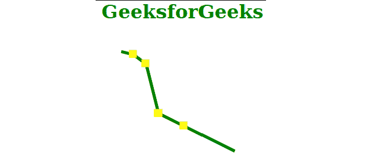
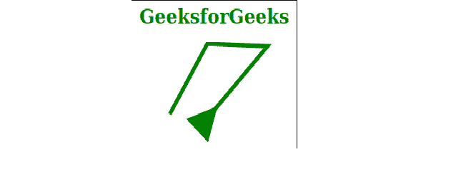

# SVG 标记宽度属性

> 原文:[https://www.geeksforgeeks.org/svg-markerwidth-attribute/](https://www.geeksforgeeks.org/svg-markerwidth-attribute/)

*标记宽度*属性表示视口的宽度，在该视口中， *<标记>* 根据保留范围比和视图框属性显示时将被调整。只有 *<标记>* 元素在使用这个属性。

**语法:**

```html
markerWidth = "length-percentage" | "number"
```

**属性值:***标记第*属性接受上面提到的和下面描述的值。

*   **长度百分比:**表示标记的相对或绝对宽度。
*   **数字:**表示标记的宽度，单位由*标记其*属性定义。

**注意:***标记第*属性的默认值为 3。

**示例 1:** 以下是说明*标记*属性使用的示例。

## 超文本标记语言

```html
<!DOCTYPE html>
<html>

    <body>
        <h1 style="color: green; 
            margin-left: 10px;">
            GeeksforGeeks
        </h1>

        <svg viewBox="-20 -5 1220 520" 
             xmlns="http://www.w3.org/2000/svg">
             <defs>
                <marker id="geek" 
                    markerWidth="2.5" 
                    markerHeight="2.5" 
                    refX="1.5" 
                    refY="1.5">
                   <circle cx="6" cy="6" r="10" 
                    stroke="none" fill="yellow"/>
                </marker>
              </defs>

            <polyline points="20, 20 40, 25 60,
                    40 80, 120 120, 140 200, 180"
                    style="fill:none;stroke:green;
                    stroke-width:5" 
                    marker-mid="url(#geek)"/>
          </svg>
    </body>

</html>
```

**输出:**



**例 2:**

## 超文本标记语言

```html
<!DOCTYPE html>
<html>

    <body>
        <h1 style="color: green; 
            margin-left: 10px;
            font-size: 25px;">
            GeeksforGeeks
        </h1>

        <svg viewBox="0 15 1220 520" 
             xmlns="http://www.w3.org/2000/svg">
            <defs>
                <marker id="geek"
                    viewBox="0 0 10 10"
                    refX="5" refY="5"
                    markerUnits="strokeWidth"
                    markerWidth="10"
                    markerHeight="8"
                    orient="auto">
                   <path d="M 0 0 L 10 5 L 0 10 z" 
                    fill="#008000"/>
                </marker>
            </defs>

            <polyline points="100, 105 180,
                    20 100, 17 50, 100"
                    stroke="green" 
                    stroke-width="5"
                    fill ="none"
                    marker-start="url(#geek)"/>
          </svg>
    </body>

</html>
```

**输出:**

