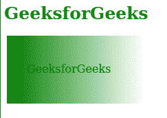

# SVG 遮罩属性

> 原文:[https://www.geeksforgeeks.org/svg-mask-attribute/](https://www.geeksforgeeks.org/svg-mask-attribute/)

SVG `<em>`掩码属性用于将定义了该属性的元素与给定的 *<掩码>* 元素绑定。它主要影响以下要素。 *< a >、<圆>、< clipPath >、<椭圆>、< g >、<字形>、<像>、<线>、<标记>、<遮罩>、<路径>、<图案>、<*

**语法:**

```html
mask = Keyword values
```

或者

```html
mask = Image values
```

或者

```html
mask = Global values
```

**属性值:***遮罩*属性可用于以下元素。

*   **关键词值:**该属性值包括*无*等值。
*   **图像值:**该属性值使用 SVG 图形内的像素图像或元素作为遮罩。
*   **全局值:**该属性值包括*继承、初始、*和*取消设置*等值。

**例 1:**

## 超文本标记语言

```html
<!DOCTYPE html>  
<html> 

    <body>  
        <h1 style="color: green;
            font-size: 25px;
            margin-left: -3px;">
            GeeksforGeeks
        </h1>
        <svg viewBox="0 0 600 100" 
             xmlns="http://www.w3.org/2000/svg">
            <mask maskContentUnits="objectBoundingBox"
                  id="geek">
              <rect fill="white" x="0" y="0" 
                  width="100%" height="100%" />
              <polygon fill="black" 
                  points="0.5, 0.2 0.68, 0.74 0.21,
                  0.41 0.79, 0.41 0.32, 0.74"/>
            </mask>
            <rect  fill="green" x="0" y="0" 
                  width="15%" height="90%" 
                  mask="url(#geek)"/>
        </svg>
    </body> 

</html>
```

**输出:**


**例 2:**

## 超文本标记语言

```html
<!DOCTYPE html>  
<html> 

    <body>  
        <h1 style="color: green;
            font-size: 25px;
            margin-left: -3px;">
            GeeksforGeeks
        </h1>

        <svg>
            <defs>
                <linearGradient id="geek"
                    x1="0%"   y1="0%"
                    x2="100%" y2="0%"
                    spreadMethod="reflect">
                   <stop offset="10%"  
                    stop-color="yellow" 
                    stop-opacity="1"/>
                   <stop offset="100%" 
                    stop-color="#000000" 
                    stop-opacity="1"/>
                </linearGradient>

                <mask id="geeky" 
                     x="0" y="0" 
                     width="200" 
                     height="100">
                    <rect x="0" y="0"  
                     width="200" 
                     height="100"
                     style="fill:url(#geek)"/>
                </mask>
            </defs>

            <text x="30" y="55" 
                style="fill: black;">
                GeeksforGeeks
            </text>

            <rect x="1" y="1" 
                width="200" 
                height="100"
                style="stroke: none; 
                fill: green; 
                mask: url(#geeky)"/>
        </svg>
    </body> 

</html>
```

**输出:**

