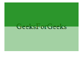
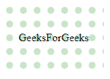

# SVG `<mask>`元素

> 原文:[https://www.geeksforgeeks.org/svg-mask-element/](https://www.geeksforgeeks.org/svg-mask-element/)

**<遮罩>** 元素定义了输入对象的透明度和可见性。它对输入对象应用掩码。它在屏幕上显示元素或图像的选定部分，同时隐藏其余部分。SVG 代表可缩放矢量图形。它可以用来制作像在 HTML 画布中的图形和动画。

**语法:**

```html
<mask> Contents... </mask>

```

**属性:**

*   **x，y —** 定义用户坐标系中的 x 和 y 轴坐标。
*   **宽度** —对象的宽度。
*   **高度** —物体的高度。
*   **maskUnits** —它有两个值 user space onuse/object boundingbox。默认值为 objectBoundingBox。x、y、宽度和高度的坐标由 maskUnits 定义。
*   **maskcontentnits**—它有两个值 user space onuse/objectBoundingBox。默认值为 objectBoundingBox。遮罩的子内容的坐标由遮罩定义。

**例 1:**

## 超文本标记语言

```html
<!DOCTYPE html>
<html>

<body>
    <svg width="400" height="400">
        <defs>
            <mask id="mask" x="0" y="0" 
                width="200" height="200">

                <rect x="0" y="0" width="250" 
                    height="50" fill="lightgreen" />

                <rect x="0" y="50" width="350" 
                    height="50" fill="green" />
            </mask>
        </defs>

        <text x="25" y="55" style=
            "stroke: none; fill: #000000;">
            GeeksForGeeks
        </text>

        <rect x="1" y="1" width="150" height="200"
            style="stroke: none; fill: green; 
                mask: url(#mask)" />
    </svg>
</body>

</html>
```

**输出:**



**注意:**文字只在蒙版透明的地方可见。

**例 2:**

## 超文本标记语言

```html
<!DOCTYPE html>
<html>

<body>
    <svg width="400" height="400">
        <defs>
            <pattern id="pattern" x="10" y="10" 
                width="20" height="20" 
                patternUnits="userSpaceOnUse">

                <circle cx="5" cy="5" r="5" 
                    style="stroke: none; fill: red" />
            </pattern>

            <mask id="mask" x="0" y="0" 
                width="200" height="100">

                <rect x="0" y="0" width="200" 
                    height="100" style="stroke:none; 
                    fill: url(#pattern)" />
            </mask>
        </defs>

        <text x="28" y="55" style=
            "stroke: none; fill: #000000;">
            GeeksForGeeks
        </text>

        <rect x="2" y="2" width="150" height="200" 
            style="stroke: none; fill: green; 
            mask: url(#mask)" />
    </svg>
</body>

</html>
```

**输出:**

