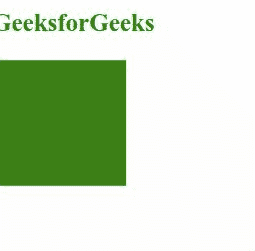
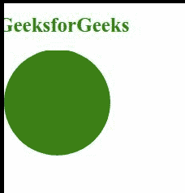

# SVG 媒体属性

> 原文:[https://www.geeksforgeeks.org/svg-media-attribute/](https://www.geeksforgeeks.org/svg-media-attribute/)

*媒体*属性显示了一个媒体查询，必须匹配该查询才能应用样式表。只有< *风格* >元素是使用这个属性的。

**语法:**

```html
<style media="media-query-list">
    // Styling the element
</style>
```

**属性值:***媒体*属性接受上面提到的和下面描述的值:

*   **媒体查询列表:**该值保存媒体查询，该查询允许样式表应用于元素。

下面的例子说明了*媒体*属性的使用。

**例 1:**

```html
<!DOCTYPE html>
<html>

<body>
    <h1 style="margin-left: -8px;
        font-size: 25px; color: green;">
        GeeksforGeeks
    </h1>

    <svg viewBox="0 10 1440 220" 
        xmlns="http://www.w3.org/2000/svg">

        <!-- Styling rect element when screen 
            size is greater than 800px -->
        <style>
            rect {
                fill: yellowgreen;
            }
        </style>

        <!-- Styling rect element when screen
            size is greater than 800px and 
            using media attribute-->
        <style media="all and (min-width: 800px)">
            rect {
                fill: green;
            }
        </style>

        <!-- Defining rectangular shape SVG -->
        <rect y="20" width="200" height="200" />
    </svg>
</body>

</html>
```

**输出:**



**例 2:**

```html
<!DOCTYPE html>
<html>

<body>
    <h1 style="margin-left: -8px;
        color: green; font-size: 25px;">
        GeeksforGeeks
    </h1>

    <svg viewBox="0 2 1440 220" 
        xmlns="http://www.w3.org/2000/svg">

        <!-- Styling rect element when screen
            size is greater than 800px -->
        <style>
            circle {
                fill: yellowgreen;
            }
        </style>

        <!-- Styling rect element when screen
            size is greater than 800px and 
            using media attribute-->
        <style media="all and (min-width: 800px)">
            circle {
                fill: green;
            }
        </style>

        <!-- Defining circular shape SVG -->
        <circle r="100" cx="100" cy="100" />
    </svg>
</body>

</html>
```

**输出:**

