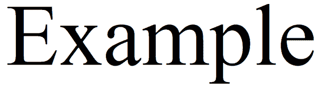
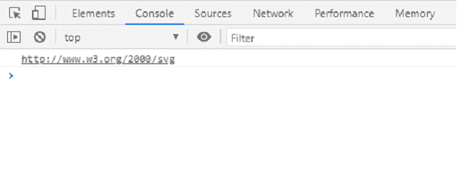

# SVG namespaceURI 属性

> 原文:[https://www.geeksforgeeks.org/svg-namespaceuri-property/](https://www.geeksforgeeks.org/svg-namespaceuri-property/)

SVG `<em>` namespaceURI 属性返回给定属性元素的 namespaceURI。

**语法:**

```html
namespace = attribute.namespaceURI

```

**返回值:**该属性返回属性的名称空间 URI。

**例 1:**

## 超文本标记语言

```html
<!DOCTYPE html>
<html>

<body>
    <svg viewBox="0 0 100 100" 
        xmlns="http://www.w3.org/2000/svg">

        <!-- A link around a text -->
        <text id="gfg" y="20" x="20"> 
            Example
        </text>

        <script>
            const element = 
                document.querySelector("#gfg");

            console.log(element.namespaceURI);
        </script>
    </svg>
</body>

</html>
```

**输出:**




**例 2:**

## 超文本标记语言

```html
<!DOCTYPE html>
<html>

<body>
    <svg viewBox="0 0 100 100" 
        xmlns="http://www.w3.org/2000/svg">

        <!-- A link around a shape -->
        <circle id="gfg" cy="20" cx="20" r="15"> 
            Example
        </circle>

        <script>
            const element = document.querySelector("#gfg");
            console.log(element.namespaceURI);
        </script>
    </svg>
</body>

</html>
```

**输出:**


**参考:**[https://developer . Mozilla . org/en-US/docs/Web/API/Attr/namespace uri](https://developer.mozilla.org/en-US/docs/Web/API/Attr/namespaceURI)