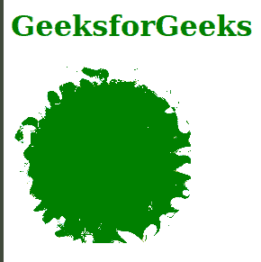

# SVG 八元属性

> 哎哎哎:# t0]https://www . geeksforgeeks . org/SVG-numoctaves 属性/

*numOctaves* 属性定义了*<fetumble>*原语的噪声函数的八度音数量。只有 *<元素使用这个属性。*

**语法:**

```html
numOctaves = "integer"

```

**属性值:***numOctaves*属性接受上面提到的和下面描述的值

*   **整数:**此值显示八度音程数。

**示例 1:** 以下示例说明了 *numOctaves* 属性的使用。

## 超文本标记语言

```html
<!DOCTYPE html>
<html>

<body>
    <h1 style="color: green;">
        GeeksforGeeks
    </h1>

    <svg width="200" height="200" 
        viewBox="0 0 220 220" 
        xmlns="http://www.w3.org/2000/svg">

        <filter id="geek1">
            <feTurbulence baseFrequency="0.05" 
                numOctaves="1" result="turbulence" />
            <feDisplacementMap in2="turbulence" 
                in="SourceGraphic" scale="50" 
                xChannelSelector="R"
                yChannelSelector="G" />
        </filter>

        <circle cx="100" cy="100" r="100" 
            fill="green" style="filter: url(#geek1)" />
    </svg>
</body>

</html>
```

**输出:**



**例 2:**

## 超文本标记语言

```html
<!DOCTYPE html>
<html>

<body>
    <div style="color: green; 
            margin-left: 50px;">
        <h1>GeeksforGeeks</h1>

        <svg viewBox="0 0 480 100" 
            xmlns="http://www.w3.org/2000/svg">

            <filter id="geek2" x="-20%" 
                y="-20%" width="150%" 
                height="150%">

                <feTurbulence type="turbulence" 
                    baseFrequency="0.05" 
                    numOctaves="5" 
                    result="turbulence" />

                <feDisplacementMap in2="turbulence" 
                    in="SourceGraphic" scale="20" />
            </filter>

            <polygon points=
                "50, 9 60.5, 39.5 92.7, 40.1 67,
                59.5 76.4, 90.3 50, 71.9 23.6,
                90.3 32.9, 59.5 7.2, 40.1 39.4, 39.5" 
                style="filter: url(#geek2);"
                fill="hsl(106, 80%, 50%)" />
        </svg>
    </div>
</body>

</html>
```