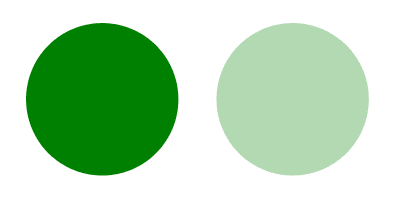

# SVG 不透明度属性

> 原文:[https://www.geeksforgeeks.org/svg-opacity-attribute/](https://www.geeksforgeeks.org/svg-opacity-attribute/)

**不透明度**属性指定一个对象或一组对象的透明度。

**语法:**

```html
opacity= "opacity"
```

**属性值:**

*   **小数:**要使元素不透明的小数

我们将使用不透明度属性来设置元素的不透明度。

**示例 1:** 在本例中，我们将使用不透明度属性来设置圆形元素的不透明度。

```html
<!DOCTYPE html>
<html>

<body>
    <svg viewBox="0 0 700 350" 
        xmlns="http://www.w3.org/2000/svg">

        <circle cx="50" cy="50" 
            r="40" fill="green" />

        <circle cx="150" cy="50" r="40" 
            fill="green" opacity="0.3" />
    </svg>
</body>

</html>
```

**输出:**



**示例 2:** 在本例中，我们将使用不透明度属性来设置矩形元素的不透明度。

```html
<!DOCTYPE html>
<html>

<body>
    <svg viewBox="0 0 700 350" 
        xmlns="http://www.w3.org/2000/svg">

        <rect height="50" width="50" 
            fill="green" opacity="0.3" />
    </svg>
</body>

</html>
```

**输出:**

