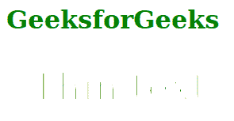
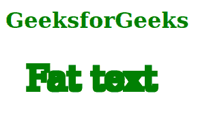

# SVG 操作员属性

> 原文:[https://www.geeksforgeeks.org/svg-operator-attribute/](https://www.geeksforgeeks.org/svg-operator-attribute/)

*运算符*属性定义了要执行的合成操作或变形操作。使用该属性的元素包括: *<【铁化合物】>* 和 *<铁化合物>。*

**语法:**

```html
operator = erode|dilate|over|arithmetic|out|atop|xor|lighter|in
```

**属性值:***运算符*属性接受上面提到的和下面描述的值

*   **结束:**显示在属性中的*中定义的源图形被放置在 *in2* 属性中定义的目标图形上。*
*   中的**表示在属性中的*中定义的源图形部分替换了在*2*属性中定义的目标图形。***
*   **出:**显示属性中*定义的源图形部分。*
*   **top:**表示源图形中与目的图形重叠的部分替换了目的图形。
*   **xor:** 表示在属性中的*中定义的源图形的非重叠区域与在 in2 属性中定义的目的图形相结合。*
*   **较亮:**显示分别在中的*和*中的*属性中定义的源图形和目的图形之和。*
*   **算术:**显示分别在中的*和*中的*属性中定义的源图形和目的图形使用以下公式组合:*结果= k1*i1*i2 + k2*i1 + k3*i2 + k4**
*   **侵蚀:**细化属性中*定义的源图形。*
*   **扩张:**使属性中*定义的源图形变胖。*

以下示例说明了*运算符*属性的使用。

**例 1:**

## 超文本标记语言

```html
<!DOCTYPE html>
<html>

<body>
    <h1 style="color: green;">
        GeeksforGeeks
    </h1>

    <svg viewBox="0 0 420 70"
        xmlns="http://www.w3.org/2000/svg">

        <filter id="thin">
            <feMorphology operator="erode" radius="0.4" />
        </filter>

        <text x="10" y="20" fill="green" filter="url(#thin)">
            Thin text
        </text>
    </svg>
</body>

</html>
```

**输出:**



**例 2:**

## 超文本标记语言

```html
<!DOCTYPE html>
<html>

<body>
    <h1 style="color: green;">
        GeeksforGeeks
    </h1>

    <svg viewBox="0 0 420 70"
        xmlns="http://www.w3.org/2000/svg">

        <filter id="fat">
            <feMorphology operator="dilate" radius="0.8" />
        </filter>

        <text x="10" y="20" fill="green" filter="url(#fat)">
            Fat text
        </text>
    </svg>
</body>

</html>
```

**输出:**

