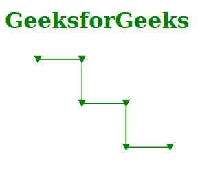

# SVG 定向属性

> 原文:[https://www.geeksforgeeks.org/svg-orient-attribute/](https://www.geeksforgeeks.org/svg-orient-attribute/)

*方向*属性显示了当标记放置在形状上的位置时，它是如何旋转的。只有< *标记* >元素正在使用此属性。

**语法:**

```html
orient = auto | auto-start-reverse | angle | number
```

**属性值:***方向*属性接受上面提到的和下面描述的值

*   **auto:** 它显示标记被定向，使得其正 x 轴指向相对于放置标记的位置处的路径的方向。
*   **自动启动-反向:**如果此属性与标记启动一起使用，则标记的方向与指定自动时使用的方向相差 180°。
*   **角度:**指定的角度是形状的正 x 轴和标记之间的度量。
*   **数字:**表示角度，单位为度。

以下示例说明了*方向*属性的使用。

**例 1:**

```html
<!DOCTYPE html>
<html>

<body>
    <h1 style="color: green;">
        GeeksforGeeks
    </h1>

    <svg viewBox="-30 30 800 100" 
        xmlns="http://www.w3.org/2000/svg">

        <defs>
            <marker id="geek" viewBox="0 0 10 10" 
                refX="5" refY="5" markerWidth="7" 
                markerHeight="7" orient="90deg">

                <path d="M 0 0 L 10 5 L 0 10 z" 
                    fill="green" />
            </marker>
        </defs>

        <polyline points="0, 40 40, 40 40, 80 80,
            80 80, 120 120, 120 120" 
            style="fill:white;stroke:green;" 
            marker-start="url(#geek)"
            marker-mid="url(#geek)" 
            marker-end="url(#geek)" />
    </svg>
</body>

</html> 
```

**输出:**



**例 2:**

```html
<!DOCTYPE html>
<html>

<body>
    <h1 style="color: green;">
        GeeksforGeeks
    </h1>

    <svg viewBox="-30 0 800 100" 
        xmlns="http://www.w3.org/2000/svg">

        <defs>
            <marker id="arrow" 
                viewBox="0 0 10 10" 
                refX="5" refY="5" 
                markerWidth="7" 
                markerHeight="7" fill="green"
                orient="auto-start-reverse">

                <path d="M 0 0 L 10 5 L 0 10 z" />
            </marker>
        </defs>

        <polyline points="2, 2 2, 60 60, 90"
            fill="none" stroke="green" 
            marker-start="url(#arrow)"
            marker-end="url(#arrow)" />
    </svg>
</body>

</html>
```

**输出:**

