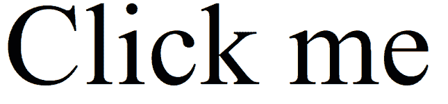
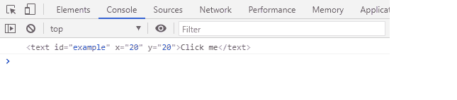
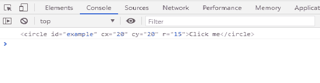

# SVG 自有物业

> 原文:[https://www.geeksforgeeks.org/svg-ownerelement-property/](https://www.geeksforgeeks.org/svg-ownerelement-property/)

SVG `<em>`所有权属性返回给定属性元素的所有权。

**语法:**

```html
name = attribute.ownerElement

```

**返回值:**该属性返回属性的所有者属性。

**例 1:**

## 超文本标记语言

```html
<!DOCTYPE html>
<html>

<body>
    <svg viewBox="0 0 100 100" 
        xmlns="http://www.w3.org/2000/svg">

        <!-- A link around a text -->
        <text id="example" x="20" y="20">
            Click me
        </text>

        <script>
            const element = document
                .querySelector("#example");

            const attribute = element.attributes[0];
            console.log(attribute.ownerElement);
        </script>
    </svg>
</body>

</html>
```

**输出:**




**例 2:**

## 超文本标记语言

```html
<!DOCTYPE html>
<html>

<body>
    <svg viewBox="0 0 100 100" 
        xmlns="http://www.w3.org/2000/svg">

        <!-- A link around a shape -->
        <circle id="example" cx="20" 
            cy="20" r="15">
            Click me
        </circle>

        <script>
            const element = document
                .querySelector("#example");

            const attribute = element.attributes[0];
            console.log(attribute.ownerElement);
        </script>
    </svg>
</body>

</html>
```

**输出:**


