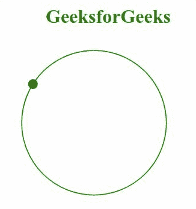

# SVG 路径属性

> 原文:[https://www.geeksforgeeks.org/svg-path-attribute/](https://www.geeksforgeeks.org/svg-path-attribute/)

*路径*属性定义了文本路径或运动路径，并分别显示文本的字符或动画显示被引用的元素。使用该属性的元素包括:*T6【动画情感】T7*和*T8【文本路径】T9。*

**语法:**

```html
path = path-data

```

**属性值:***路径*属性接受上面提到的和下面描述的值

*   **路径数据:**它有两个不同的值，即它可以定义文本路径或运动路径以及要分别渲染或动画化的字形。

**注意:**其默认值视为正常。

下面的例子说明了*路径*属性的使用。

**例 1:**

## 超文本标记语言

```html
<!DOCTYPE html>
<html>

<body>
    <h1 style="color: green; 
            margin-left: 10px;">
        GeeksforGeeks
    </h1>

    <svg viewBox="0 10 500 100" 
        xmlns="http://www.w3.org/2000/svg">

        <path fill="green" 
            d = "M10, 90 Q90, 90 90, 45 Q90,
                10 50, 10 Q10, 10 10, 40 Q10,
                70 45, 70 Q70, 70 75, 50" />

        <text>
            <textPath 
                path = "M10, 90 Q90, 90 90,
                        45 Q90, 10 50, 10 Q10,
                        10 10, 40 Q10, 70 45,
                        70 Q70, 70 75, 50">
                It is a Compute Science Portal
            </textPath>
        </text>
    </svg>
</body>

</html>
```

**输出:**


**例 2:**

## 超文本标记语言

```html
<!DOCTYPE html>
<html>

<body>
    <h1 style="color: green; 
            margin-left: 80px;">
        GeeksforGeeks
    </h1>

    <svg viewBox="0 15 700 200" 
        xmlns="http://www.w3.org/2000/svg">

        <path fill="none" stroke="green" 
            d = "M 100, 100 m -75, 0 a 75,
                75 0 1, 0 150, 0 a 75, 75 
                0 1, 0 -150, 0" />

        <circle r="5" fill="green">
            <animateMotion dur="5s" 
                repeatCount="indefinite" 
                path="M 100, 100 m -75, 0 a 
                75, 75 0 1, 0 150, 0 a 75, 
                75 0 1, 0 -150,0" />
        </circle>
    </svg>
</body>

</html>
```

**输出:**

